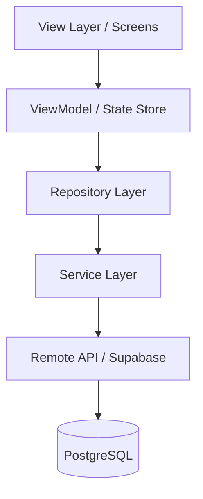

# TrimiT — The Ultimate Salon Ecosystem

[](https://en.wikipedia.org/wiki/Model%E2%80%93view%E2%80%93viewmodel)
[](https://fastapi.tiangolo.com/)
[](https://supabase.com/)

TrimiT is a premium, full-stack marketplace platform designed to bridge the gap between salon owners and customers. Built with scalability and enterprise-grade architecture at its core, TrimiT provides a "Zomato-like" experience for the grooming and wellness industry.

---

## 🌟 Product Vision

### For Customers
TrimiT offers a seamless discovery and booking engine. Customers can find high-rated salons nearby, explore detailed service menus with transparent pricing, check real-time availability, and secure appointments with integrated digital payments.

### For Salon Owners
TrimiT acts as a robust Business Management Suite. Owners can digitalize their entire operation—from service management and real-time scheduling to advanced analytics and earnings tracking—allowing them to focus on service quality while TrimiT handles the logistics.

---

## 🏗 Technical Architecture

TrimiT follows a **Strict MVVM (Model-View-ViewModel)** pattern combined with the **Repository Pattern** and a dedicated **Service Layer**. This ensures a clean separation of concerns, making the codebase maintainable and testable.

### Data Flow


- **UI (View)**: Purely responsible for rendering and user interaction. No business logic.
- **ViewModel**: Manages the UI state (e.g., Zustand/React Query). Orchestrates data fetching via Repositories.
- **Repository**: The single source of truth for data. It decides whether to fetch from local cache or the Service layer.
- **Service**: Low-level API client handling HTTP requests, headers, and raw DTO transformations.
- **Infrastructure**: Centralized error handling, API clients, and environment configuration.

---

## 🛠 Feature Matrix

| Feature | Customer | Owner | Status |
| :--- | :---: | :---: | :--- |
| **Discovery** | Nearby Search | Salon Profile | ✅ Implemented |
| **Booking** | Slot Selection | Schedule Management | ✅ Implemented |
| **Payments** | Razorpay Integration | Earnings Dashboard | ✅ Implemented |
| **Reviews** | Post-Service Rating | Reputation Management | ✅ Implemented |
| **Analytics** | Booking History | Business Insights | ✅ Implemented |
| **Notifications** | Appointment Alerts | New Booking Alerts | 📅 Planned |

---

## 📂 Project Structure

```text
TrimiT/
├── backend/            # FastAPI (Python) - Modular REST API
├── mobile/             # React Native (Expo) - Premium Cross-platform App
├── frontend/           # React 19 (Tailwind) - Web Dashboard & Portal
├── database/           # SQL Schemas & Supabase Migrations
└── shared/             # Shared Types, Constants, and Legal Docs
```

---

## 🤖 AI Context Block (For LLM Ingestion)
> [!IMPORTANT]
> This section provides instant context for AI coding assistants (ChatGPT, Claude, etc.).

- **Core Tech**: Python 3.10+ (FastAPI), TypeScript (React/React Native), PostgreSQL (Supabase).
- **Architecture**: MVVM + Repository + Service Layer.
- **State Management**: Zustand for global state, React Query for server state.
- **Styling**: Tailwind CSS (Web), NativeWind/StyleSheet (Mobile).
- **Coding Standards**: Strict typing (no `any`), modular services, centralized error handling, environment-based configuration.
- **Primary Entities**: `Users`, `Salons`, `Services`, `Bookings`, `Reviews`.

---

## 🚀 Quick Start

### 1. Prerequisites
- Node.js (v18+)
- Python (v3.10+)
- Supabase Account

### 2. Environment Configuration
Create `.env` files in both `/backend` and `/mobile` (or `/frontend`) based on the provided `.env.example` templates.

### 3. Database Initialization
Run the schema located in `database/schema.sql` within your Supabase SQL Editor to provision the necessary tables and RLS policies.

### 4. Launching the Services
- **Backend**: `cd backend && source venv/bin/activate && uvicorn server:app --port 8001`
- **Mobile**: `cd mobile && npm start`
- **Web**: `cd frontend && npm run dev`

---

## 📈 Scalability & Security
- **RLS (Row Level Security)**: All database access is governed by Supabase RLS, ensuring users only see their own data.
- **Modular Services**: The backend is designed for transition from a monolithic structure to microservices.
- **Typed DTOs**: Strict TypeScript interfaces for all API responses to prevent runtime failures.

---

## 📜 License
TrimiT is proprietary software. All rights reserved. (Or MIT as per previous context)

---
*Created by [Arqum Malik](https://github.com/arqummalik)*
