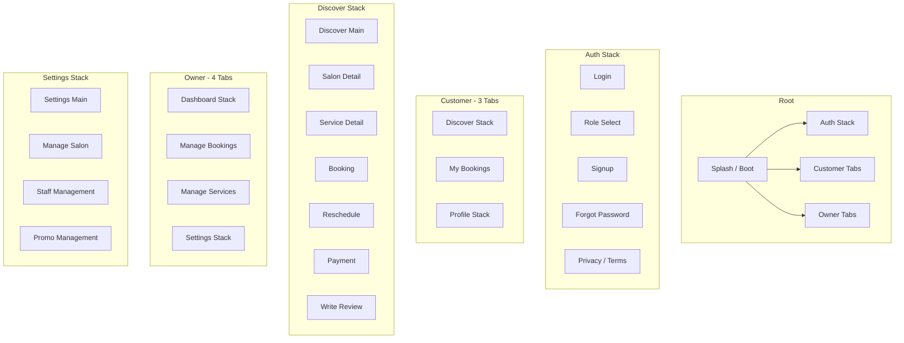

# TrimiT Mobile — Google Stitch UI Design Specification

**Purpose:** Feed this document into [Google Stitch](https://stitch.withgoogle.com) (or any AI UI tool) so generated screens match the **real TrimiT product**: same flows, components, and information architecture as the React Native app in `mobile/`.

**Product:** TrimiT — salon marketplace for India. Customers discover salons, book appointments, pay at salon (v1). Salon owners manage bookings, services, staff, and promos.

**Platforms:** Android & iOS (portrait only). **Not** Expo Go — design for standalone app chrome.

---

## 1. Product summary (for Stitch context)

| Attribute | Value |
|-----------|--------|
| **Name** | TrimiT |
| **Tagline direction** | “Book salons near you” / “Salon booking & management” |
| **Primary users** | **Customer** (book services) · **Salon owner** (run business) |
| **One app, two roles** | Same install; role chosen at signup |
| **v1 payments** | Pay at salon (cash); online pay hidden in production |
| **Core actions** | Discover → Salon → Service → Book slot → Confirm · Owner: Accept bookings → Manage calendar |
| **Differentiators** | Map + list discovery, real-time slots, staff picker, owner push alerts for new bookings |

---

## 2. Modern UI direction (what to design toward)

Design a **premium, calm, modern** mobile UI — not generic purple gradients or stock “beauty app” clichés.

| Principle | Guidance |
|-----------|----------|
| **Aesthetic** | Warm stone backgrounds + deep orange brand (light mode default). Optional dark mode: obsidian + gold accents. |
| **Typography** | Headings: elegant serif (Cormorant Garamond). Body/UI: clean sans (Inter). |
| **Shape language** | Rounded cards (12–16px), **pill buttons** (full radius), soft shadows on cards |
| **Density** | Comfortable spacing (16–20px screen padding); avoid cramped lists |
| **Imagery** | Salon photos hero-style; map for discovery |
| **Motion** | Subtle — skeleton loaders, button success/error states, tab transitions |
| **Icons** | Ionicons-style outlined icons (search, calendar, person, storefront) |

**Avoid:** Neon gradients, Material You-only patterns that clash with brand orange, cluttered dashboards, tiny tap targets on slot grids.

---

## 3. Design tokens (implement literally)

### 3.1 Light mode (default — match Play Store v1)

| Token | Hex | Usage |
|-------|-----|--------|
| `background` | `#FAFAF9` | Page background (stone-50) |
| `surface` | `#FFFFFF` | Cards, inputs |
| `surfaceSecondary` | `#F5F5F4` | Chips, nested areas |
| `text` | `#1C1917` | Primary text |
| `textSecondary` | `#78716C` | Subtitles, meta |
| `textTertiary` | `#A8A29E` | Placeholders, tab inactive |
| `primary` | `#9A3412` | CTAs, active tab, links (orange-800) |
| `primaryLight` | `#FFF7ED` | Tinted badges, selected chips |
| `secondary` | `#065F46` | Secondary actions (emerald) |
| `success` | `#059669` | Confirmed, success buttons |
| `error` | `#DC2626` | Errors, destructive |
| `warning` | `#D97706` | Pending states |
| `star` | `#F59E0B` | Ratings |
| `border` | `#E7E5E4` | Dividers, input borders |

### 3.2 Dark mode (optional screens)

| Token | Hex |
|-------|-----|
| `background` | `#121411` |
| `primary` | `#f1d18d` (gold) |
| `surface` | `#1A1C19` |
| `text` | `#F5F5F5` |

### 3.3 Typography scale

| Style | Font | Size | Weight | Use |
|-------|------|------|--------|-----|
| H1 | Cormorant Garamond | 36 | Bold | Marketing/auth hero |
| H2 | Cormorant Garamond | 28 | Bold | Screen titles |
| H3 | Cormorant Garamond | 22 | SemiBold | Section headers |
| H4 | Inter | 18 | SemiBold | Card titles |
| Body | Inter | 16 | Regular | Paragraphs |
| Body small | Inter | 14 | Regular | Meta, captions |
| Button | Inter | 16 | SemiBold | Buttons |
| Overline | Inter | 11 | Bold, uppercase, +2 letter-spacing | Section labels |

### 3.4 Spacing & radius

| Token | Value |
|-------|-------|
| Screen horizontal padding | 20px |
| Card padding | 16px |
| Section gap | 24px |
| Item gap | 12px |
| Radius sm/md/lg/xl | 4 / 8 / 12 / 16px |
| Button radius | Pill (999px) |
| Tab bar height | 56px + safe area |

---

## 4. Global components library

Design these as **reusable components** in Stitch; every screen composes them.

### 4.1 Navigation

| Component | Description |
|-----------|-------------|
| **Bottom tab bar** | 3 tabs (customer) or 4 tabs (owner). Active = `primary`, inactive = `textTertiary`. Icons below. |
| **Stack header** | Back chevron left, title center/left, optional action right. No heavy native bar — custom in-screen headers common. |
| **Splash / boot** | Logo tile (orange rounded square + white mark), “TrimiT” wordmark, spinner |

### 4.2 Buttons (`Button`)

| Variant | Look | When |
|---------|------|------|
| **primary** | Filled `primary`, white text | Main CTA |
| **secondary** | Filled emerald | Alternate CTA |
| **outline** | Border `border`, transparent fill | Secondary |
| **ghost** | Text only | Tertiary |
| **Sizes** | sm / md / lg — more vertical padding on lg | |
| **States** | loading (spinner), success (green), error (shake + red) | Form submit |

### 4.3 Inputs (`Input`)

- Label above (14px medium)
- Rounded field (8px), border `border`, focus ring `primary`
- Optional left icon (mail, lock, search)
- Error text below in `error` red
- Password field: eye toggle right

### 4.4 Cards

| Card | Contents |
|------|----------|
| **SalonCard** | Image 16:9 top, distance badge on image, name + star rating + address snippet + “from ₹X” |
| **ServiceCard** | Thumbnail, name, duration, price, chevron |
| **BookingCard** | Service name, date/time, status pill, salon/customer name, action buttons (owner) |
| **Stat card** (owner) | Small icon in tinted circle, label, large number |

### 4.5 Lists & discovery

| Component | Description |
|-----------|-------------|
| **Search bar** | Full-width pill or rounded rect, search icon left, placeholder “Search salons…” |
| **Segmented control** | List \| Map toggle (Discover) |
| **Horizontal date scroller** | Chips for next 14 days (Booking, Reschedule) |
| **Time slot grid** | 3–4 columns of pill chips; available / selected / disabled / booked |
| **Filter chips** | Period: Today \| 7d \| 30d \| All (owner dashboard) |
| **Status pills** | pending (amber), confirmed (green), completed, cancelled (gray/red) |

### 4.6 Map

- Full-screen or large map area
- Custom pins for salons
- Cluster bubbles when many pins
- FABs: recenter, zoom +/- (optional)
- Permission primer modal before location (illustration + Allow / Not now)

### 4.7 Feedback

| Component | Description |
|-----------|-------------|
| **Toast** | Top/bottom banner, success/error/info |
| **EmptyState** | Icon, title, subtitle, optional CTA button |
| **ErrorState** | Inline banner or full block + Retry |
| **Skeleton** | Shimmer placeholders for list/cards/dashboard |
| **OfflineBanner** | Slim bar when no network |
| **SessionExpiredModal** | Modal: session expired, go to login |

### 4.8 Modals & sheets

| Modal | Purpose |
|-------|---------|
| **BookingNotificationModal** | Owner: new booking — Accept / Reject |
| **StaffFormModal** | Add/edit staff member |
| **LocationPickerModal** | Map pin for salon address (owner) |
| **StaffProfileCard** | Bottom sheet style staff bio |
| **PermissionPrimer** | Location permission education |

### 4.9 Owner-only widgets

| Component | Description |
|-----------|-------------|
| **WorkingHoursEditor** | Per-day open/close toggles + time pickers |
| **BookingsTrendChart** | Line chart |
| **PopularServicesChart** | Bar chart |
| **StatusDistributionChart** | Donut/bar by status |
| **NotificationSettingsSection** | Toggles: bookings, updates, promotional |
| **PulseIndicator** | Green live dot on dashboard |

### 4.10 Misc

| Component | Description |
|-----------|-------------|
| **ImageCarousel** | Salon detail hero swiper + dots |
| **Star rating row** | 1–5 stars selectable (Write review) |
| **Promo code row** | Text input + Apply button |
| **StaffPicker** | Horizontal avatars + “Any available” |
| **MarkdownView** | Legal pages body text |
| **TrimiTLogoMark** | Brand mark for auth |

---

## 5. App architecture & navigation

**Rule:** User sees **either** Customer **or** Owner tabs after login — never both.

---

## 6. Screen-by-screen specification

For each screen: **purpose**, **layout zones**, **components**, **key copy**, **states**.

---

### 6.1 Auth flow (unauthenticated)

#### A1 — Login (`LoginScreen`)

| Zone | Components |
|------|------------|
| Top | Logo, “Welcome back”, subtitle |
| Form | Email `Input`, Password `Input` (toggle visibility) |
| Actions | Primary “Sign in”, text link “Forgot password?” |
| Footer | “Don’t have an account?” → Sign up, links Privacy / Terms |
| States | Field validation errors, inline API error banner, button loading |

#### A2 — Role select (`RoleSelectScreen`)

| Zone | Components |
|------|------------|
| Header | “Join TrimiT”, subtitle |
| Body | Two large **role cards** side by side or stacked: **Customer** (people icon) “Book appointments” · **Owner** (storefront icon) “List your business” |
| Footer | “Already have an account?” → Login |

#### A3 — Signup (`SignupScreen`)

| Zone | Components |
|------|------------|
| Form | Name, Email, Phone, Password, Confirm password |
| Context | Shows selected role (customer/owner) |
| Legal | Checkbox “I agree to Terms & Privacy” |
| CTA | Primary “Create account” |
| States | Email confirmation message if required |

#### A4 — Forgot password (`ForgotPasswordScreen`)

| Zone | Components |
|------|------------|
| Form | Email input |
| CTA | “Send reset link” |
| Helper | Success message after submit |

---

### 6.2 Customer — Discover tab

#### C1 — Discover main (`DiscoverScreen`)

| Zone | Components |
|------|------------|
| Header | “Discover” or location subtitle (“Near you”) |
| Search | **Search bar** (filters list client-side) |
| Toggle | **List \| Map** segmented control |
| List mode | `FlatList` of **SalonCard**, pull-to-refresh, infinite scroll |
| Map mode | **Map** + markers/clusters, permission primer if needed |
| States | Skeleton list, EmptyState “No salons nearby”, ErrorState + retry, offline banner |

#### C2 — Salon detail (`SalonDetailScreen`)

| Zone | Components |
|------|------------|
| Hero | **ImageCarousel** (salon photos) |
| Info | Name H2, star rating + review count, address, hours snippet |
| Map mini | Small map preview + “Directions” |
| Services | Section “Services”, list of **ServiceCard** |
| CTA sticky | Optional bottom bar “Book now” on scroll |

#### C3 — Service detail (`ServiceDetailScreen`)

| Zone | Components |
|------|------------|
| Hero | Service image |
| Body | Name, description, duration, price |
| CTA | Primary “Book appointment” → Booking |

#### C4 — Booking (`BookingScreen`) — **most complex screen**

| Zone | Components |
|------|------------|
| Header | Back, salon + service title |
| Staff | **StaffPicker** (Any available + staff avatars) |
| Date | Horizontal **date chips** |
| Slots | **Time slot grid** (30-min windows) |
| Promo | Optional promo `Input` + Apply (if enabled) |
| Payment method | Segmented **Pay at salon** (v1 default) / Pay online (hidden v1) |
| Summary | Price, discount, total |
| Hold timer | “Slot held for MM:SS” when applicable |
| Footer | Primary “Confirm booking” |
| States | Loading slots, conflict error, success → navigate bookings |

#### C5 — Reschedule (`RescheduleBookingScreen`)

Same structure as Booking but: shows current booking summary, new date/slots, optional reason `Input`, CTA “Reschedule”.

#### C6 — Payment (`PaymentScreen`)

| Zone | Components |
|------|------------|
| Summary | Booking recap, amount |
| v1 | Message “Pay at salon” (online disabled) |
| v2 design | Razorpay WebView area (for future) |

#### C7 — Write review (`WriteReviewScreen`)

| Zone | Components |
|------|------------|
| Body | Star picker 1–5, multiline review text |
| CTA | Submit review |

---

### 6.3 Customer — Bookings tab

#### C8 — My bookings (`MyBookingsScreen`)

| Zone | Components |
|------|------------|
| Header | “My Bookings” |
| List | **BookingCard** per row: service, salon, date/time, status |
| Actions | Tap → detail/reschedule; completed → write review |
| States | EmptyState “No bookings yet”, skeleton, pull-to-refresh |

---

### 6.4 Customer — Profile tab

#### C9 — Profile main (`ProfileScreen`)

| Zone | Components |
|------|------------|
| Header | “My Profile” |
| Avatar | Circle with initial, name, role badge Customer |
| Section Account | View/edit name, phone; Edit/Save toggle |
| Section Appearance | Theme: Light \| Dark \| System |
| Section Notifications | **NotificationSettingsSection** toggles |
| Section Legal | Rows → Privacy, Terms, Contact |
| Danger | Logout, Delete account (destructive) |

#### C10–C12 — Legal (`PrivacyPolicy`, `Terms`, `Contact`)

| Zone | Components |
|------|------------|
| Header | Back + title |
| Body | **MarkdownView** scrollable text |
| Contact | Email, phone, deletion web link |

---

### 6.5 Owner — Dashboard tab

#### O1 — Dashboard main (`OwnerDashboardScreen`)

| Zone | Components |
|------|------------|
| Header | Salon name, **PulseIndicator** “Live” |
| Period | Chips: Today \| 7d \| 30d \| All |
| Stats row | 4× **Stat cards**: revenue, bookings, pending, completed (icons + values) |
| Charts | **BookingsTrendChart**, **PopularServicesChart**, **StatusDistributionChart** |
| Recent | “Recent bookings” + up to 3 **BookingCard** |
| Empty | No salon registered → CTA “Set up salon” → Manage Salon |
| States | DashboardSkeleton, ErrorState |

#### O2 — Manage salon (`ManageSalonScreen`) — also in Settings stack

| Zone | Components |
|------|------------|
| Form | Salon name, description, phone, address |
| Location | **LocationPickerModal** / map pin |
| Media | Image upload grid |
| Hours | **WorkingHoursEditor** |
| CTA | Save |

---

### 6.6 Owner — Bookings tab

#### O3 — Manage bookings (`ManageBookingsScreen`)

| Zone | Components |
|------|------------|
| Header | “Bookings” |
| Filters | Status chips or tabs: All \| Pending \| Confirmed \| … |
| List | **BookingCard** with Accept/Complete/Cancel actions |
| States | Empty, skeleton; tab badge shows pending count |

---

### 6.7 Owner — Services tab

#### O4 — Manage services (`ManageServicesScreen`)

| Zone | Components |
|------|------------|
| Header | “Services” + add button |
| List | Service rows: name, price, duration, active toggle |
| Form | Add/edit service modal or inline form |
| States | ServiceListSkeleton, EmptyState |

---

### 6.8 Owner — Settings tab

#### O5 — Settings main (`SettingsScreen`)

| Zone | Components |
|------|------------|
| Header | “Settings” |
| Salon section | Cards linking to **Manage Salon**, **Staff**, **Promos**, jump to **Services** tab |
| Notifications | Owner notification toggles |
| Account | Logout, Delete account |
| Legal | Privacy, Terms, Contact rows |
| States | Limited UI if no salon yet |

#### O6 — Staff management (`StaffManagementScreen`)

| Zone | Components |
|------|------------|
| List | Staff cards: photo, name, active badge |
| Actions | Add staff, edit, deactivate |
| Modal | **StaffFormModal** |

#### O7 — Promo management (`PromoManagementScreen`)

| Zone | Components |
|------|------------|
| List | Promo codes: code, discount %, validity |
| CTA | Create promo form |

---

### 6.9 Global overlays (any role)

| Screen | Components |
|--------|------------|
| **ErrorBoundary** | Friendly error + Try again + Hard reset |
| **Toast** | Floating confirmation |
| **BookingNotificationModal** | Owner incoming booking |

---

## 7. Data displayed on key UI elements

| Element | Fields |
|---------|--------|
| SalonCard | `name`, `distance_km`, `avg_rating`, `images[0]`, min service price |
| BookingCard | `service_name`, `salon_name`, `booking_date`, `slot_time`, `status`, `total_amount` |
| ServiceCard | `name`, `price`, `duration_minutes`, image |
| Stat card | `title`, `value`, icon metaphor |

**Currency:** ₹ (INR). **Dates:** locale-aware, e.g. “Mon, 16 May · 10:30 AM”.

---

## 8. States matrix (design every screen with these)

| State | Visual treatment |
|-------|------------------|
| **Loading** | Skeleton or centered spinner on brand color |
| **Empty** | EmptyState illustration + headline + CTA |
| **Error** | ErrorState with Retry |
| **Offline** | Top banner + disabled CTAs optional |
| **Success** | Toast + green check on button |
| **Disabled** | 40% opacity, no shadow |

---

## 9. What NOT to design (out of scope / deferred)

- Expo Go shell
- Web dashboard (separate CRA app)
- Razorpay checkout UI detail (v1 off) — optional single “Pay at salon” confirmation
- Admin/super-admin panels
- Chat/messaging between user and salon
- Social feed

---

## 10. Google Stitch prompt templates

Copy-paste and replace `{screen}`:

**Master prompt:**

> Design a mobile app screen for **TrimiT**, a salon booking app for India. Use light mode: background #FAFAF9, primary CTA #9A3412, Inter body + Cormorant Garamond headings. Modern premium style: rounded cards, pill buttons, 20px horizontal padding. Portrait iPhone 15 size. No purple gradients.

**Per-screen example (Discover):**

> TrimiT Discover screen: top search bar “Search salons”, segmented control List/Map, scrollable salon cards with photo, name, 4.5★, distance km, price from ₹199. Bottom tab bar: Discover (active), Bookings, Profile. Include empty state variant.

**Per-screen example (Booking):**

> TrimiT booking screen: header with service name, horizontal staff selector chips, horizontal date picker, 4-column time slot grid, pay-at-salon selected, order summary, sticky Confirm booking button orange pill.

**Per-screen example (Owner dashboard):**

> TrimiT owner dashboard: salon name header, period chips Today/7d/30d/All, 2×2 stat cards grid, line chart, recent bookings list, bottom tabs Dashboard/Bookings/Services/Settings.

---

## 11. Source of truth in code

| Area | Path |
|------|------|
| Screens | `mobile/src/screens/` |
| Components | `mobile/src/components/` |
| Navigation | `mobile/src/navigation/` |
| Theme | `mobile/src/theme/` |
| Types | `mobile/src/types/` |

When Stitch output diverges from this doc, **this doc + code win** for product accuracy; Stitch wins for visual polish.

---

## 12. Checklist before exporting Stitch screens

- [ ] All customer + owner tabs represented
- [ ] Booking flow完整: Discover → Salon → Service → Booking → Success
- [ ] Owner booking accept modal designed
- [ ] Light mode primary; dark mode optional second pass
- [ ] Status colors consistent (pending/confirmed/cancelled)
- [ ] INR pricing and India-relevant copy tone
- [ ] Touch targets ≥ 44pt for slot chips and list rows

---

*Document generated from TrimiT `mobile/` codebase inventory. Update when screens are added or removed.*
