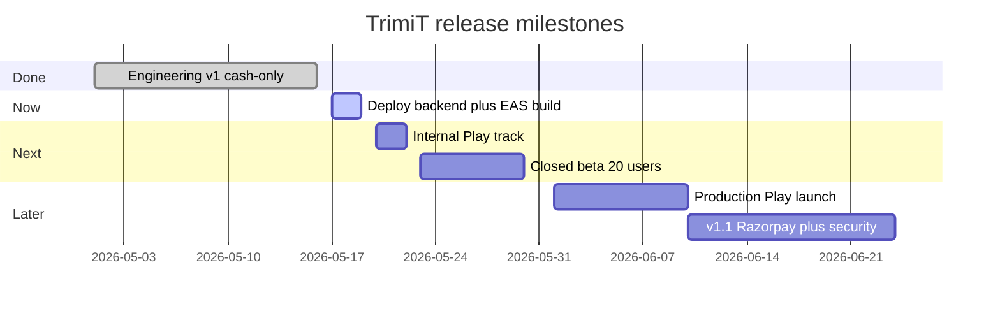

# TrimiT — V1 Daily Progress Tracker (Notion)

> **Copy this page into Notion** (or use as your daily markdown log). Update the **Status** column each day.  
> **Last updated:** 2026-05-16 · **v1 mode:** Cash-only Android · **Readiness:** ~78% engineering / **Play upload:** pending ops

---

## Where we stand (v1 production)

| Area | Status | Notes |
|------|--------|-------|
| **Product (mobile)** | Ready for closed beta | Discover → book (cash) → owner complete → push |
| **Backend** | Code ready — **redeploy Render** | Rate limits, Razorpay API (UI off), `staff_availability` router |
| **Database** | Applied on Supabase (24–27) | Slot UNIQUE, FOR UPDATE RPC; pg_cron deferred |
| **Web** | Secondary, OK for owners | Cash booking; Bell import fixed |
| **Play Store** | **Not live yet** | Need EAS keystore + AAB + Console forms |
| **Payments in app** | **Off (v1)** | `EXPO_PUBLIC_ENABLE_ONLINE_PAY=false` → v1.1 |

**Honest verdict:** Engineering for cash-only v1 is largely **done**. You are in the **ship phase** (build, test on device, Play Console), not the build-features phase.

**Production readiness score:** ~**78 / 100** (up from 58 after this sprint)  
**Remaining to public Play:** mostly **manual ops** (3–7 calendar days after you start EAS build).

---

## Milestone roadmap (what’s next)

### M1 — Engineering complete (cash-only v1) — DONE
- [x] Migrations 24–27 on production Supabase
- [x] Cash-only mobile (`featureFlags` + EAS env)
- [x] Staff availability API (`staff_availability.py`)
- [x] Backend hardening (rate limit, payments code, salon_cash paid status)
- [x] Web MyBookings fix
- [x] Ops docs: `PLAY_STORE_V1_OPS.md`, `CASH_E2E_V1.md`, `POST_V1_BACKLOG.md`

### M2 — Deploy and first production build — IN PROGRESS (you)
- [ ] Push latest `main` and confirm Render auto-deploy (or manual deploy)
- [ ] `eas credentials` → production Android upload keystore (backup passwords!)
- [ ] `eas build --profile production --platform android`
- [ ] Install on physical device
- [ ] Run [`docs/qa/CASH_E2E_V1.md`](./qa/CASH_E2E_V1.md) and sign off

### M3 — Play internal testing
- [ ] Upload AAB to internal track
- [ ] Data Safety form ([`PLAY_CONSOLE_CHECKLIST.md`](./PLAY_CONSOLE_CHECKLIST.md))
- [ ] Content rating (IARC)
- [ ] Store listing (icon 512, feature graphic, screenshots, descriptions)
- [ ] Reviewer test accounts in App Access
- [ ] Fix pre-launch report issues

### M4 — Closed beta
- [ ] 10–20 real users (salons + customers)
- [ ] Monitor Sentry + Play crashes
- [ ] Collect feedback channel (email/WhatsApp from legal contact)

### M5 — Production Play launch
- [ ] Promote internal → production (or closed → open)
- [ ] Privacy URL stable: https://trimi-t.vercel.app/privacy
- [ ] Account deletion verified in-app + web

### M6 — v1.1 (post-launch app update)
See [`POST_V1_BACKLOG.md`](./POST_V1_BACKLOG.md):
- Razorpay UI (`EXPO_PUBLIC_ENABLE_ONLINE_PAY=true`)
- RPC security hardening (revoke anon EXECUTE)
- Full staff CRUD API rewrite
- Push deep links, Expo receipt cleanup
- Web parity improvements

---

## Daily progress table (update every day)

**Columns for Notion database:** Task · Status · Priority · Module · Deadline · Notes · Done ☑

| Task | Status | Priority | Module | Done |
|------|--------|----------|--------|------|
| Apply DB migrations 24–27 | Done | P0 | Database | ☑ |
| Cash-only mobile + feature flag | Done | P0 | Mobile | ☑ |
| Staff availability endpoint | Done | P0 | Backend | ☑ |
| Deploy backend to Render | Not started | P0 | DevOps | ☐ |
| EAS upload keystore | Not started | P0 | Mobile | ☐ |
| EAS production AAB build | Not started | P0 | Mobile | ☐ |
| Device E2E cash flow test | Not started | P0 | QA | ☐ |
| Play Data Safety form | Not started | P0 | Legal | ☐ |
| Play store screenshots + copy | Not started | P1 | Design | ☐ |
| Reviewer test accounts | Not started | P1 | QA | ☐ |
| Maps API key SHA-1 restrict | Not started | P2 | DevOps | ☐ |
| Re-run `07_check_rls_policies.sql` | Not started | P2 | Database | ☐ |
| Enable Razorpay in app (v1.1) | Deferred | — | Mobile | — |

**Status options:** `Not started` · `In progress` · `Blocked` · `Done`

---

## Daily standup template (copy each morning)

### Standup — YYYY-MM-DD

**Yesterday**
- 

**Today**
- 

**Blockers**
- 

**Milestone focus** (M2 / M3 / M4 / M5 / M6)
- 

**Metrics** (optional)
- Crash-free: 
- Beta users active: 
- Open P0 bugs: 

---

## Production readiness board (Kanban columns)

### Security — mostly done
| Item | Status |
|------|--------|
| Rate limits wired | Done |
| Request signing removed (JWT only) | Done |
| JWT required in production | Done |
| RPC anon revoke | Deferred v1.1 |

### Backend — deploy pending
| Item | Status |
|------|--------|
| staff_availability router | Done (needs deploy) |
| salon_cash → payment_status paid | Done |
| Real Razorpay API (backend) | Done (UI off) |

### Mobile — build pending
| Item | Status |
|------|--------|
| Cash-only UI | Done |
| Permission strip plugin | Done |
| R8 / shrink (expo-build-properties) | Done (verify on build) |
| Upload keystore | **You** |

### Play Store — not started
| Item | Status |
|------|--------|
| Signed AAB | **You** |
| Data Safety | **You** |
| Internal track | **You** |

---

## Quick links

| Doc | Use for |
|-----|---------|
| [PLAY_STORE_V1_OPS.md](./PLAY_STORE_V1_OPS.md) | EAS build + Play steps |
| [CASH_E2E_V1.md](./qa/CASH_E2E_V1.md) | Device test script |
| [launch-readiness.md](./audit/launch-readiness.md) | Go/no-go gates |
| [POST_V1_BACKLOG.md](./POST_V1_BACKLOG.md) | After v1.0 |
| [MIGRATION_ORDER.md](./database/MIGRATION_ORDER.md) | DB state |

---

## Weekly scorecard (fill Fridays)

| Week ending | Readiness % | Milestone | Shipped | Notes |
|-------------|-------------|-----------|---------|-------|
| 2026-05-16 | 78% | M1 done | Code to `main` | Cash-only v1 |
| | | M2 | | |
| | | M3 | | |
