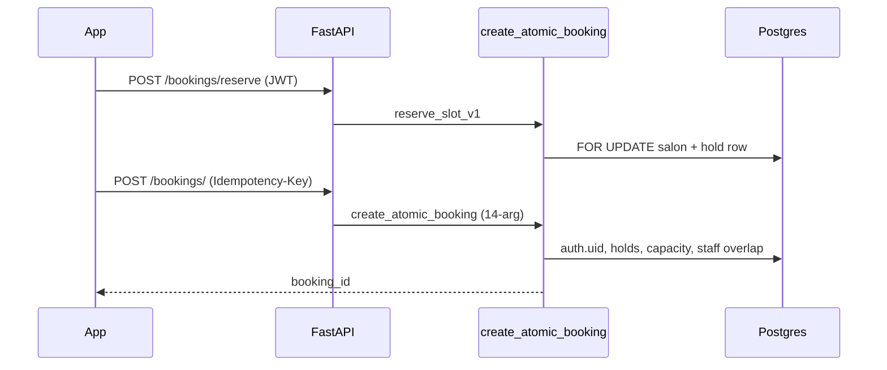

# TrimiT Production Readiness Audit Report (Post-Remediation)

**Audit date:** 17 May 2026 (re-audit)  
**Prior audit:** Same day (pre-migration) — score **5.8/10**, **CONDITIONAL NO-GO**  
**Scope:** Mobile (Expo SDK 54), Backend (FastAPI `/api/v1`), Web (`frontend/`), Supabase (migrations 01–35 applied per owner)  
**Launch scope:** Narrow v1 — cash-only (`EXPO_PUBLIC_ENABLE_ONLINE_PAY=false`), staff picker off, prefer single-booking salons  
**Method:** Full codebase review + verification that migrations **29–35** and phase 0–6 code remediations address prior critical findings.

**Living progress:** [PROGRESS.md](./PROGRESS.md)

---

## 1. Executive Summary

TrimiT has moved from **architecturally sound but booking-unsafe** to **conditionally ready for Play Store closed testing** after:

- **Database:** Migrations **29–35** applied in Supabase (RPC `auth.uid()`, holds at commit, unique-index fix, reschedule IDOR, idempotency path, staff-aware RPC, reschedule holds).
- **Backend:** Idempotency caches `JSONResponse`, payment amount verification, geocode proxy, owner payment rules, production-gated reserve fallback.
- **Mobile:** Auth bootstrap gate (`authBootstrapComplete`), notification dedupe/replay guard, `useFocusEffect` slot subscription, memoized list cards, feature flags for pay/staff, Sentry on production EAS profile.

**Remaining before wide production:** deploy matching backend to Render, run the **8-test QA matrix** on a physical Android 13+ device, build release AAB with `npm run verify:env`, and complete Play Console Data safety + privacy.

**Customer cash booking** is the primary path; treat **multi-chair salons** and **services longer than 30 minutes** as higher-risk until QA proves slot/RPC overlap behavior.

**Recommendation:** **GO** for **internal / closed testing** track after backend deploy + QA. **NOT GO** for production rollout to all users until QA is recorded and 1–2 weeks of closed feedback.

---

## 2. Production Readiness Score

| Area | Pre (5/17 am) | Post (5/17 pm) | Notes |
|------|---------------|----------------|-------|
| Customer booking (cash, single-booking salon) | 6/10 | **8/10** | Holds + RPC hardened; device QA pending |
| Customer booking (multi-chair) | 4/10 | **6.5/10** | Index fixed; hold optional when `allow_multiple` — race residual |
| Customer booking (online pay) | 4/10 | **5/10** | Code ready; **flag off** in `eas.json` |
| Owner operations | 7/10 | **7.5/10** | Dedupe improved; multi-salon list improved in backend |
| Auth & session | 7/10 | **8/10** | Bootstrap complete flag; cold-start replay guarded |
| Navigation & performance | 6/10 | **7/10** | Memo on cards; 12 screens still bypass repository layer |
| Notifications & realtime | 5/10 | **7.5/10** | Dedupe + owner realtime guard |
| Backend security | 4/10 | **7.5/10** | RPC auth; IDOR fixed; slots still use service_role reads |
| Play Store / release engineering | 7/10 | **8/10** | Env gates, ProGuard, Sentry prod profile; QA not run |
| Web frontend | 6/10 | **6.5/10** | Prod logging gated |
| **Overall** | **5.8/10** | **7.4/10** | **Conditional GO** (closed testing) |

---

## 3. Critical Blockers

### Status: All six original critical items **RESOLVED** (code + migrations applied)

| ID | Issue | Resolution |
|----|--------|------------|
| CRIT-01 | Holds not enforced at commit | **Migration 29** + **34** — RPC counts `slot_holds`; single-booking requires user's hold |
| CRIT-02 | `uq_bookings_active_slot` vs multi-booking | **Migration 30** — index dropped |
| CRIT-03 | Staff dropped in RPC | **Migration 34** — `p_staff_id` / overlap function; UI gated via `ENABLE_STAFF_SELECTION` |
| CRIT-04 | RPC without `auth.uid()` | **Migrations 29, 34** — `UNAUTHORIZED` / `FORBIDDEN`; anon revoke |
| CRIT-05 | Idempotency not caching dict responses | **`backend/core/idempotency.py`** + **migration 32** |
| CRIT-06 | Reschedule history IDOR | **Migration 31** |

### Active gate (not code — ops)

| | |
|---|---|
| **Severity** | Critical for *launch*, not for *code merge* |
| **Issue** | Backend on Render may still run **pre-remediation** build; RPC signature is **14-arg** after migration 34 |
| **Fix** | Deploy latest `backend/`; smoke-test `POST /api/v1/bookings/` and `GET .../slots` |
| **Risk** | `BOOKING_RPC_FAILED`, 500s, or schema mismatch |

---

## 4. High Priority Issues (remaining)

### HIGH-01: Device QA matrix not executed

| | |
|---|---|
| **Severity** | High |
| **Root cause** | Remediation verified in code/SQL only |
| **Reproduction** | Ship AAB without concurrent-booking test → latent double-book on misconfigured salon |
| **Affected** | Entire booking stack |
| **Fix** | Run tests 1–8 in [PROGRESS.md](./PROGRESS.md); record pass/fail |
| **Risk** | Play Store 1-star reviews, salon churn |

---

### HIGH-02: Multi-booking salons — hold optional at commit

| | |
|---|---|
| **Severity** | High (only if `allow_multiple_bookings_per_slot = true`) |
| **Root cause** | Migration **34** requires hold for single-booking only; multi mode can commit without reserve |
| **Affected** | `database/34_create_atomic_booking_staff.sql`, `backend/routers/bookings.py` |
| **Reproduction** | Two users pick same slot on multi-chair salon without reserving → both may pass RPC until capacity |
| **Fix (v1)** | **Product:** onboard only single-booking salons. **Code (v1.1):** require reserve for all salons or use DB advisory lock per slot window |
| **Risk** | Over-capacity bookings under load |

**Mitigation for first Play upload:** Configure test + prod salons with `allow_multiple_bookings_per_slot = false`.

---

### HIGH-03: `GET /bookings/slots` uses service_role reads

| | |
|---|---|
| **Severity** | High (security hygiene) |
| **Root cause** | Slot aggregation bypasses RLS (`service_role=True` at lines ~354–358) |
| **Affected** | `backend/routers/bookings.py` |
| **Reproduction** | Compromised anon key cannot call RPC, but could scrape occupancy if route were ever exposed without auth |
| **Fix** | Use user JWT client for reads; keep service_role only for server-side cron/admin |
| **Risk** | Information disclosure; inconsistent with RLS model |

---

### HIGH-04: MVVM violation — 12 screens call `lib/api` directly

| | |
|---|---|
| **Severity** | High (maintainability / regression risk) |
| **Root cause** | Legacy screens predating strict repository pattern |
| **Affected files** | `BookingScreen.tsx`, `DiscoverScreen.tsx`, `SalonDetailScreen.tsx`, `MyBookingsScreen.tsx`, `PaymentScreen.tsx`, `RescheduleBookingScreen.tsx`, `WriteReviewScreen.tsx`, `ProfileScreen.tsx`, `ServiceDetailScreen.tsx`, `ManageBookingsScreen.tsx`, `SettingsScreen.tsx`, `ForgotPasswordScreen.tsx` |
| **Fix** | Route through `bookingService` / hooks (`useQuery` in thin hook files); no new direct imports |
| **Risk** | Inconsistent error handling, duplicate interceptors behavior, harder to test |

---

### HIGH-05: Write Review flow unreachable

| | |
|---|---|
| **Severity** | High (feature dead) |
| **Root cause** | `WriteReview` registered in `CustomerStack.tsx` but **no** `navigation.navigate('WriteReview', …)` from `MyBookingsScreen` or `BookingCard` |
| **Affected** | `mobile/src/screens/customer/WriteReviewScreen.tsx`, `backend/routers/reviews.py` (requires `booking_id`) |
| **Reproduction** | Complete booking → no UI to leave review |
| **Fix** | Add "Rate visit" on completed bookings in `BookingCard` → `WriteReview` with `bookingId` + `salonId` |
| **Risk** | Low crash risk; reviews feature unused |

---

## 5. Medium Priority Issues

### MED-01: Service duration vs slot grid (salon-level)

| | |
|---|---|
| **Severity** | Medium |
| **Root cause** | Slot API advances **30 min** steps; occupancy keyed by **start time only** — does not block 10:30 when 10:00 has 60 min service (unless staff overlap RPC path used) |
| **Affected** | `backend/routers/bookings.py` (~418–449), `create_atomic_booking` (staff overlap in **34** only when `staff_id` set) |
| **Fix** | Mark slots unavailable for `[start, start+duration)`; align RPC salon-level check with staff overlap logic |
| **Risk** | Overlapping appointments for long services |

---

### MED-02: Idempotency check-then-act race

| | |
|---|---|
| **Severity** | Medium |
| **Root cause** | `backend/core/idempotency.py` GET then INSERT — concurrent duplicate keys can both execute handler |
| **Affected** | `backend/core/idempotency.py`, `database/32_idempotency_unique_path.sql` |
| **Fix** | INSERT-first with `ON CONFLICT` return cached row; or unique constraint + retry |
| **Risk** | Rare duplicate booking on simultaneous double-tap (mitigated by RPC uniqueness for single-booking) |

---

### MED-03: TypeScript `any` remains

| | |
|---|---|
| **Severity** | Medium (standards) |
| **Affected** | `StaffManagementScreen.tsx`, `promotionRepository.ts`, `authService.ts`, `StaffFormModal.tsx`, `analytics.ts`, etc. |
| **Fix** | Replace with typed DTOs from `mobile/src/types/` |
| **Risk** | Runtime shape bugs at compile-time escape |

---

### MED-04: React Query persist + 1h staleTime

| | |
|---|---|
| **Severity** | Medium |
| **Root cause** | `App.tsx` persists cache 24h; default `staleTime: 1 hour` — Discover salon list can be stale after owner updates |
| **Affected** | `mobile/App.tsx`, Discover queries |
| **Fix** | Lower staleTime for `['salons']` / invalidate on focus for owner-managed fields |
| **Risk** | Wrong hours/images until manual refresh |

---

### MED-05: Cash booking success — manual navigation

| | |
|---|---|
| **Severity** | Medium (UX) |
| **Root cause** | After cash book, user stays on success screen; must tap "View Bookings" |
| **Affected** | `BookingScreen.tsx` (~744–818) |
| **Fix** | Optional auto-navigate to Bookings tab after 2s or primary CTA default |
| **Risk** | Users think flow ended on Discover |

---

### MED-06: Pending online bookings expiry — cron not enabled

| | |
|---|---|
| **Severity** | Medium (deferred with pay flag off) |
| **Root cause** | Migration **33** creates `expire_pending_online_bookings()`; pg_cron optional |
| **Fix** | Enable cron or Render cron hitting admin endpoint when `ENABLE_ONLINE_PAY` ships |
| **Risk** | Ghost slot occupancy when online pay enabled |

---

### MED-07: `staff.py` router disabled

| | |
|---|---|
| **Severity** | Medium |
| **Root cause** | Commented in `server.py` pending httpx migration |
| **Affected** | `backend/routers/staff.py`, `server.py` |
| **Risk** | Staff management only via Supabase direct / owner UI limited |

---

### MED-08: Discover map memory (tab stays mounted)

| | |
|---|---|
| **Severity** | Medium (low-end Android) |
| **Root cause** | Map continues rendering when switching tabs |
| **Fix** | Pause/unmount map on `tabPress` blur (deferred in plan) |
| **Risk** | Jank, battery drain on old devices |

---

## 6. Low Priority Improvements

| ID | Item | Files |
|----|------|-------|
| LOW-01 | `SignatureMiddleware` defined but not mounted | `backend/server.py` |
| LOW-02 | `console.warn` in App font failure (acceptable) | `mobile/App.tsx` |
| LOW-03 | Web CRA bundle not code-split | `frontend/` |
| LOW-04 | Owner dashboard chart re-renders on every booking realtime event | `OwnerDashboardScreen.tsx` |
| LOW-05 | `BookingScreen` still sends `staff_id`/`any_staff` when staff UI hidden | `BookingScreen.tsx` — harmless if null |
| LOW-06 | Re-run `07_check_rls_policies.sql` after 29–35 | `database/07_check_rls_policies.sql` |

---

## 7. Navigation Optimization Recommendations

| Finding | Recommendation |
|---------|----------------|
| Root waits for `fontsLoaded && authBootstrapComplete` | **Keep** — prevents login flash |
| Tab stacks stay mounted | Acceptable; add `lazy` on heavy stack screens if bundle grows |
| `navigationRef` for push | **Keep**; dedupe via `trimit_last_handled_notification_id` |
| Booking success back stack | Cash path uses in-screen success; consider `navigation.reset` to tabs |
| Nested `Discover` for reschedule | Works; document for QA |
| Missing memo on `BookingScreen` | Large screen — extract slot grid to `React.memo` child if profiling shows jank |

---

## 8. Performance Optimization Recommendations

| Area | Action |
|------|--------|
| Lists | `SalonCard`, `BookingCard` already memoized — extend to `renderItem` stable refs in Discover/MyBookings |
| Images | Use `salonImage.ts` helpers + consistent thumbnail sizes (recent work) |
| Query | Scope `staleTime` per query key; don't use 1h global for slots (`staleTime: 0`, invalidate on realtime) |
| Realtime | `useRealtimeBookings` + `useFocusEffect` on BookingScreen — **good** |
| Startup | `InteractionManager` for persist — **good** |
| Bundle | Audit unused fonts (Manrope + Inter + Cormorant) for APK size |

---

## 9. Booking Engine Risks (current state)



| Risk | Status |
|------|--------|
| Double book (single-booking) | **Low** after 29–30–34 |
| Double book (multi-booking, no reserve) | **Medium** — product/config mitigation |
| Stale slots after cancel | **Low** — invalidate `['slots']` on cancel |
| Timezone past-slot | **Low** — client `is_local_today` + 5 min grace |
| Race reserve → book | **Low** for single-booking with hold |
| Online pay abandoned | **N/A** (flag off) |
| Reschedule capacity | **Improved** — migration **35** counts holds |

---

## 10. Security Concerns

| Item | Severity | Status |
|------|----------|--------|
| RPC callable without auth | Critical | **Fixed** (29/34) |
| Reschedule history IDOR | Critical | **Fixed** (31) |
| Payment amount tampering | High | **Fixed** — `order.fetch` in `payments.py` |
| Geocode API key in mobile APK | High | **Fixed** — `backend/routers/geocode.py` proxy |
| Uploads anon write | High | **Fixed** — owner-only `uploads.py` |
| Reviews without booking | High | **Fixed** — `booking_id` required |
| Service role on slots | High | **Open** (HIGH-03) |
| Supabase anon in APK | Expected | RLS must hold; verify with `07_check_rls` |
| JWT in AsyncStorage | Standard | `safeAuthStorage`; 401 clears session |
| Idempotency cross-user | Low | Keys scoped by `user_id` + path |

---

## 11. Realtime / Notification Concerns

| Item | Status |
|------|--------|
| Owner duplicate foreground alert | **Mitigated** — `notificationDedupe.ts`, `realtimeOwnerGuard.ts` |
| Cold-start notification replay | **Mitigated** — AsyncStorage last handled id |
| Push token on logout | Verify in QA — `authStore.clearSession` |
| Android 13 POST_NOTIFICATIONS | Declared in `withAndroidPermissions` — test denial path |
| Backend `notification_events` dedupe | Present in `booking_push.py` |
| Customer local reminder | `scheduleBookingReminder` — permission denial silent (OK) |

---

## 12. UX Concerns

| Flow | Issue | Severity |
|------|-------|----------|
| Cash book complete | User must tap "View Bookings" | Medium |
| Write review | Unreachable | High |
| Payment screen | Redirects when pay disabled — OK | — |
| Offline | `OfflineBanner` — bookings fail with toast | OK |
| Cancel booking | Confirmation alert — OK | — |
| Owner booking modal | Accept/reject from push — QA duplicate | Low |
| Empty Discover | Depends on location permission | Test on device |
| Session expired | Modal + clear — OK | — |

---

## 13. Play Store Launch Risks

| Risk | Likelihood | Mitigation |
|------|------------|------------|
| Missing privacy policy URL | High if incomplete listing | Host on `trimit.online` / legal |
| Data safety form inaccurate | Medium | Declare location, bookings, phone |
| Notification permission denial | Medium | Graceful degrade; in-app booking still works |
| Maps SDK key restriction | Medium | Restrict key to package + SHA-1; geocode on backend |
| `targetSdk` / 16KB page size | Low | Expo 54 templates — verify on Play pre-launch report |
| ANR on Discover map | Medium on low-end | MED-08 |
| Razorpay WebView policy | N/A | Pay flag off |
| Crash on missing env | Low | `getReleaseConfigIssues()` blocks broken builds |

**Build commands:**

```bash
cd mobile && npm run verify:env && npm run build:aab:local
```

**EAS profile:** `production` → `EXPO_PUBLIC_ENABLE_ONLINE_PAY=false`, Sentry upload enabled.

---

## 14. Recommended Fixes (with paths)

| Priority | Fix | Files |
|----------|-----|-------|
| P0 | Deploy backend + smoke test RPC | Render, `backend/routers/bookings.py` |
| P0 | Run QA matrix | [PROGRESS.md](./PROGRESS.md) |
| P1 | Add Write Review CTA | `BookingCard.tsx`, `MyBookingsScreen.tsx` |
| P1 | Onboard single-booking salons only | Admin / owner settings |
| P2 | JWT reads for slots endpoint | `backend/routers/bookings.py` |
| P2 | Duration-aware slot masking | `backend/routers/bookings.py` |
| P3 | Migrate screens off `lib/api` | 12 screens listed in HIGH-04 |
| P3 | INSERT-first idempotency | `backend/core/idempotency.py` |

### Snippet: Write Review navigation (MyBookings)

```tsx
// In BookingCard or MyBookings renderItem — completed bookings only
onPress={() =>
  navigation.navigate('Discover', {
    screen: 'WriteReview',
    params: { salonId: item.salon_id, bookingId: item.id },
  })
}
```

### Snippet: Stricter idempotency (conceptual)

```python
# Try insert placeholder first; on conflict select cached response
await supabase.request("POST", "rest/v1/idempotency_keys", json={...}, service_role=True)
# except unique violation → GET cached
```

---

## 15. Refactoring Opportunities (non-blocking)

1. **Booking hooks module** — `useSalonSlots`, `useCreateBooking` to shrink `BookingScreen.tsx` (~1700 lines).
2. **Owner tabs** — extract notification modal + mutation to custom hook (already partially in `OwnerTabs.tsx`).
3. **Unified API client** — `apiClient.ts` vs `lib/api.ts` naming convergence.
4. **Staff router** — re-enable with httpx async client.
5. **frontend/** — align with mobile repository pattern if web relaunch planned.

---

## 16. Resolved Issues Reference (pre-audit → now)

| Original | Resolution evidence |
|----------|---------------------|
| CRIT-01 holds | `database/29_booking_rpc_hardening.sql`, `34_create_atomic_booking_staff.sql` |
| CRIT-02 unique index | `database/30_fix_active_slot_unique_index.sql` |
| CRIT-03 staff | `database/34_...sql` + `ENABLE_STAFF_SELECTION` default false |
| CRIT-04 RPC auth | `auth.uid()` checks in 29/34 |
| CRIT-05 idempotency cache | `backend/core/idempotency.py` |
| CRIT-06 reschedule IDOR | `database/31_reschedule_history_idor.sql` |
| HIGH auth flash | `authBootstrapComplete` in `authStore.ts`, `App.tsx` |
| HIGH duplicate owner push | `notificationDedupe.ts`, `App.tsx` listeners |
| HIGH payment → Discover | `PaymentScreen.tsx` → `navigateToCustomerBookings` |
| HIGH generic 500 on book | `bookings.py` sanitized errors |
| HIGH Maps key in client geocode | `mobile/src/lib/maps.ts` → `/api/v1/geocode` |
| HIGH owner complete payment | `bookings.py` status rules |

---

## 17. Final Production Verdict

| Track | Verdict |
|-------|---------|
| **Play Store — internal / closed testing** | **GO** after: (1) backend deploy, (2) QA matrix pass, (3) AAB build + upload |
| **Play Store — production (all users)** | **NO-GO** until closed test + HIGH-02/05 addressed or accepted |
| **Nationwide marketing launch** | **NO-GO** until online pay QA (flag on), staff flag QA, multi-booking stress test |

**One-line summary:** Database and code remediations cleared the **booking safety blockers**; the app is **ready to enter Play Console internal testing** for a **cash-only, single-booking-salon** v1 — not yet proven for scale or full feature set.

---

## 18. What’s Next (operator checklist)

1. **Deploy** latest `backend/` to Render (`ENVIRONMENT=production`, `GOOGLE_MAPS_API_KEY` set).
2. **Re-run** `database/07_check_rls_policies.sql` in Supabase.
3. **Verify** anon role cannot execute `create_atomic_booking` (QA #8).
4. **Run** 8-test QA matrix on physical Android 13+ ([PROGRESS.md](./PROGRESS.md)).
5. **Build** `npm run verify:env && npm run build:aab:local`.
6. **Upload** to Play Console **internal testing** (`eas.json` submit track: internal).
7. **Complete** store listing: privacy policy, Data safety, screenshots, content rating.
8. **Configure** production salons: `allow_multiple_bookings_per_slot = false` for v1.
9. After 1–2 weeks closed test → address HIGH-04/05 → consider production track.

---

---

## 19. Production launch remediation (2026-05-17)

Code changes shipped for **production-track MVP** (no new SQL migrations):

| Audit ID | Fix | Files |
|----------|-----|-------|
| HIGH-02 | `409 HOLD_REQUIRED` if no active hold on create | `backend/routers/bookings.py`; mobile confirm always requires reserve |
| HIGH-03 | `GET /bookings/slots` requires authentication | `backend/routers/bookings.py` |
| HIGH-05 | “Rate visit” on completed bookings → WriteReview | `BookingCard.tsx`, `MyBookingsScreen.tsx` |
| MED-01 | Duration-aware slot blocking in slots API | `backend/routers/bookings.py` |
| MED-02 | INSERT-first idempotency (status 102 placeholder) | `backend/core/idempotency.py` |
| MED-04 | Discover `staleTime` 5m + `refetchOnMount: always` | `DiscoverScreen.tsx` |
| MED-05 | Primary “View Bookings” + optional 3s auto-navigate | `BookingScreen.tsx` |
| MED-08 | Unmount map when Discover tab not focused | `DiscoverScreen.tsx` |
| LOW-05 | Omit `staff_id` / `any_staff` when staff flag off | `BookingScreen.tsx` |

**Still deferred (post-launch week 1):** HIGH-04 (12-screen MVVM migration), MED-03 (`any` types), MED-06 (pg_cron), MED-07 (`staff.py` router).

**Ops before upload:** [PRODUCTION_LAUNCH_CHECKLIST.md](./PRODUCTION_LAUNCH_CHECKLIST.md)

**Updated score (code complete, QA pending):** **8.2 / 10** — production track acceptable after checklist + device QA.

---

*Report generated from repository state 2026-05-17. Update after QA completion or major releases.*
