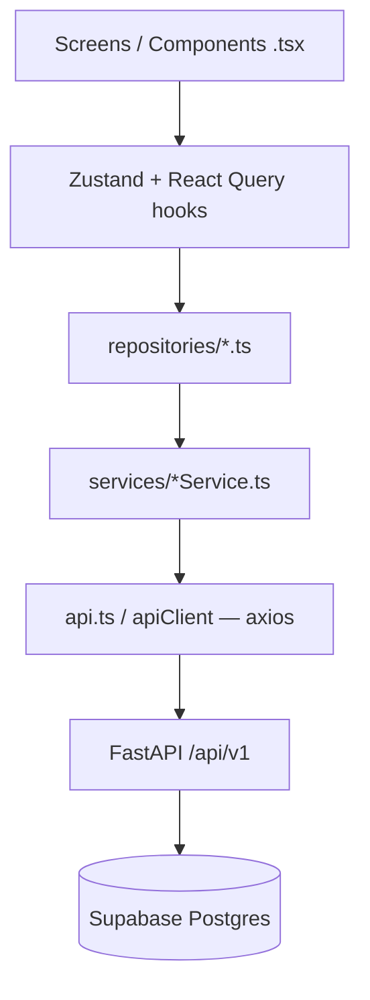

# TrimiT — Complete Project Context for AI Assistants

> **Purpose:** Paste this entire document (or attach it) when working with ChatGPT, Claude, or other AI tools so they understand TrimiT’s product, company, architecture, navigation, business logic, notifications, screens, and UI conventions without re-explaining the project.
>
> **Maintainer:** Arqum Malik · **Repo:** TrimiT monorepo (salon marketplace)  
> **Last updated:** May 2026 · **Source of truth priority:** Code > this doc > older snippets

---

## Table of contents

1. [What TrimiT is (company & product)](#1-what-trimit-is-company--product)
2. [Monorepo layout](#2-monorepo-layout)
3. [Users, roles, and permissions](#3-users-roles-and-permissions)
4. [Architecture & coding rules](#4-architecture--coding-rules)
5. [Backend (FastAPI + Supabase)](#5-backend-fastapi--supabase)
6. [Database & migrations](#6-database--migrations)
7. [Booking engine & payments (core logic)](#7-booking-engine--payments-core-logic)
8. [Notifications (push, realtime, local)](#8-notifications-push-realtime-local)
9. [Mobile app — navigation map](#9-mobile-app--navigation-map)
10. [Mobile — customer flows (every screen)](#10-mobile--customer-flows-every-screen)
11. [Mobile — salon owner flows (every screen)](#11-mobile--salon-owner-flows-every-screen)
12. [Mobile — auth, legal, shared UI](#12-mobile--auth-legal-shared-ui)
13. [Web frontend (React dashboard)](#13-web-frontend-react-dashboard)
14. [Design system & UI tokens](#14-design-system--ui-tokens)
15. [Environment variables & deployment](#15-environment-variables--deployment)
16. [Related docs in repo](#16-related-docs-in-repo)
17. [How to use this with ChatGPT](#17-how-to-use-this-with-chatgpt)

---

## 1. What TrimiT is (company & product)

**TrimiT** is a **salon marketplace platform** (think “Zomato for salons”) built for the **India market** (₹ pricing, English UI). One mobile app serves **two roles**; one web portal mirrors key flows.

| Audience | Value proposition |
|----------|-------------------|
| **Customers** | Discover nearby salons (list + map), browse services, book time slots, pay at salon or online (Razorpay), manage bookings, leave reviews. |
| **Salon owners** | Run the business from mobile: dashboard analytics, accept/reject bookings, manage services/staff/promos, salon profile & hours, push alerts for new bookings. |

**Product name / branding:** TrimiT (also written Trimit in some URLs, e.g. Render host `trimit-az5h.onrender.com`).  
**Android package:** `com.trimit.app`  
**Market positioning:** Premium, full-stack grooming/wellness booking — not a generic CRUD demo.

**v1 production notes (important for AI):**

- Mobile production builds often use **“Pay at salon”** (`salon_cash`) as the primary payment path; Razorpay exists in code but may be disabled or mocked in some environments.
- Customer UI is undergoing a **modern redesign** (Google Stitch specs); **owner UI should stay as-is** unless explicitly asked to change it.

---

## 2. Monorepo layout

```text
TrimiT/
├── backend/          # FastAPI (Python 3.10+), deployed to Render
├── mobile/           # Expo SDK 54 / React Native 0.81 / React 19 — customer + owner
├── frontend/         # Create React App + Tailwind — web portal
├── database/         # Numbered SQL migrations (run in order in Supabase SQL editor)
├── shared/legal/     # privacy.md, terms.md (used by web + mobile legal screens)
├── docs/             # Architecture, API, Stitch UI specs, ops guides
├── CONTEXT.md        # Shorter architecture summary
└── CLAUDE.md         # Agent rules for this repo (MVVM, booking invariants)
```

**Shared infrastructure:** One **PostgreSQL** database on **Supabase** (Auth + RLS + Realtime). Backend is the secure orchestrator; clients never bypass it for business logic.

---

## 3. Users, roles, and permissions

### Roles

| `users.role` | App experience after login |
|--------------|----------------------------|
| `customer` | Mobile: `CustomerTabs` (Discover · Bookings · Profile) |
| `owner` | Mobile: `OwnerTabs` (Dashboard · Bookings · Services · Settings) |

Signup chooses role on **`RoleSelectScreen`** → **`SignupScreen`** with `{ role: 'customer' | 'owner' }`.  
Login is **shared** today (`LoginScreen`); customer-only login redesign is planned (see `docs/STITCH_CUSTOMER_UI_SPEC.md`).

### Auth stack

- **Supabase Auth** issues JWT (`access_token` + `refresh_token`).
- Backend **`POST /api/v1/auth/signup`** creates `public.users` row (may use service role once).
- All authenticated API calls: `Authorization: Bearer <JWT>`.
- **RLS** on Postgres ensures users only access allowed rows; backend uses user JWT by default, **service role** only for admin bypass (e.g. profile creation).

### Session handling (clients)

- **Zustand** `authStore` persists user + token; syncs Supabase session for Realtime.
- **401** on API → clear storage, show session-expired modal, navigate to auth (`navigationRef` in mobile).
- Mobile: `safeAuthStorage` for secure persistence.

---

## 4. Architecture & coding rules

### Pattern: Strict MVVM + Repository + Service



### Non‑negotiable rules (enforce in all AI-generated code)

1. **No direct `axios`/`fetch` in view files** (`.tsx` / page `.js`). Use repositories + React Query (`useQuery` / `useMutation`).
2. Every network operation handles **loading, error, success**.
3. **No `any`** in TypeScript; types live in `mobile/src/types/index.ts`.
4. Backend **`server.py` + routers** = orchestration; reusable logic → `backend/services/`.
5. New SQL = **new numbered migration** (`database/29_*.sql`); never rewrite applied migrations.

### State management

| Layer | Technology | Location |
|-------|------------|----------|
| Server state | TanStack Query | hooks via repositories |
| Auth / theme / toasts / notifications | Zustand | `mobile/src/store/` |
| Web | Zustand + React Query | `frontend/src/store/` |

### Mobile API base URL

`mobile/src/lib/api.ts`:

1. `EXPO_PUBLIC_API_URL` if set  
2. Dev: Expo `hostUri` IP (Android emulator → `10.0.2.2`)  
3. Prod fallback: `https://trimit-az5h.onrender.com`  
4. Paths are relative to **`/api/v1`** (see `docs/API_GUIDE.md`)

---

## 5. Backend (FastAPI + Supabase)

### Entry & structure

- **Bootstrap:** `backend/server.py` — CORS, rate limits, Sentry, mounts `APIRouter(prefix="/api/v1")`.
- **Routers:** `backend/routers/{auth,salons,bookings,payments,promotions,staff_availability,owner,reviews,uploads}.py`
- **Services:** `backend/services/` — e.g. `push_dispatch.py`, `push_notifications.py`, `push_preferences.py`, `booking_push.py`
- **Auth dependency:** `backend/dependencies/auth.py` → `get_current_user`
- **Config:** `backend/config.py` / `.env`

### Public API surface

**All app traffic:** `/api/v1/...` (not legacy `/api/...` alone).  
Full route table: **`docs/API_GUIDE.md`**.

### Key domains (summary)

| Domain | Prefix | Highlights |
|--------|--------|------------|
| Auth | `/auth` | signup, login, me, profile, push-token, forgot/reset password |
| Salons | `/salons` | discovery (lat/lng/radius), CRUD, nested services |
| Bookings | `/bookings` | slots, reserve (hold), create, status, reschedule |
| Payments | `/payments` | Razorpay create-order, verify (HMAC-SHA256) |
| Owner | `/owner` | owner salon, analytics by period |
| Staff | `/staff` | availability (CRUD router may be disabled — check `server.py`) |
| Promotions | `/promotions` | validate, owner CRUD |
| Reviews | `/reviews` | post completed booking |

### Optional request signing

If `API_SIGNING_SECRET` is set, mutating requests need `X-Trimit-Timestamp` + `X-Trimit-Signature` (HMAC of `METHOD|PATH|TIMESTAMP`). Exempt: GET, auth signup/login. See `backend/core/middleware.py`.

### Discovery (salons)

- Uses RPC **`get_nearby_salons_v1`** when available (migration `19`), with Haversine-style distance server-side.
- Query params: `lat`, `lng`, `radius`, `search`, pagination.
- Mobile **sorts by `distance_km`** returned from API.

---

## 6. Database & migrations

Apply **`database/01_schema.sql` … `28_*.sql`** in order on a fresh Supabase project (manual SQL editor).

### Core tables (01_schema)

| Table | Purpose |
|-------|---------|
| `users` | Profile linked to `auth.users`; `role` ∈ customer, owner |
| `salons` | Business entity; `owner_id`, hours, lat/lng, images |
| `services` | Price, duration, salon_id |
| `bookings` | user, salon, service, date, time_slot, status, payment fields |
| `reviews` | rating 1–5, linked to booking/salon |

### Extended tables (later migrations)

| Migration area | Tables / features |
|----------------|-------------------|
| `08` | `max_bookings_per_slot`, multi-booking per slot |
| `11` | `idempotency_keys` |
| `13` | `promotions`, `promo_usage` |
| `14` | `booking_reschedules` |
| `15` | `staff`, `staff_services` |
| `20`+ | `create_atomic_booking` RPC |
| `22` | `slot_holds` (race window) |
| `21`, `24` | push tokens, notification prefs, `notification_events` dedupe |
| `25` | booking integrity, payment fields |

**RLS:** Defined in `01_schema.sql` and audited in `07_check_rls_policies.sql`. Owners see salon bookings; customers see own bookings.

**Realtime:** `bookings` table published for Supabase Realtime (migrations `05`/`06`).

---

## 7. Booking engine & payments (core logic)

### Booking statuses

| Status | Who sets | Customer | Owner |
|--------|--------|----------|-------|
| `pending` | Default on create | Cancel | Accept → `confirmed` / Reject → `cancelled` |
| `confirmed` | Owner accept | Cancel (policy) | Mark `completed` |
| `completed` | Owner | Write review | — |
| `cancelled` | Either party | — | — |

(`rejected` may appear in docs; owner reject often maps to `cancelled`.)

### Slot algorithm (`GET /api/v1/bookings/slots`)

1. Load salon opening hours for date  
2. Generate **30-minute** windows  
3. Subtract non-`cancelled` bookings  
4. Subtract active **`slot_holds`** (other users)  
5. **5-minute past-time grace** (salon timezone)  
6. Respect `max_bookings_per_slot` / `allow_multiple_bookings_per_slot`

**Race control:** `POST /bookings/reserve` → hold timer → `POST /bookings/` with **Final Guard** + DB unique constraints + `create_atomic_booking` RPC.

**Mobile:** `BookingScreen` subscribes to Realtime on `bookings` to invalidate slot queries when someone else books.

### Payment methods

| Method | Flow |
|--------|------|
| `salon_cash` | Booking created; pay at salon; owner notified |
| `razorpay` / online | create-order → Razorpay checkout → `POST /payments/verify` (HMAC signature) → `payment_status=paid` |

Verify uses `RAZORPAY_KEY_SECRET` + `hmac.sha256`.

### Reschedule

`PATCH /api/v1/bookings/{id}/reschedule` → `reschedule_booking_atomic` RPC; history in `booking_reschedules`; push to other party. Mobile: `RescheduleBookingScreen`.

### Idempotency

Clients may send idempotency keys (migration `11`) on create to avoid duplicate bookings on retry.

---

## 8. Notifications (push, realtime, local)

### Channels overview

```mermaid
flowchart LR
    subgraph backend [Backend]
        EV[Booking lifecycle events]
        PD[push_dispatch.py]
        PN[push_notifications.py - Expo API]
    end
    subgraph mobile [Mobile]
        RT[Supabase Realtime bookings]
        EX[Expo Push Token]
        LOC[Local scheduled notifications]
        MOD[BookingNotificationModal - owner]
    end
    EV --> PD --> PN --> EX
    RT --> MOD
    LOC --> Customer reminders
```

### Backend push (`backend/services/push_dispatch.py`)

- Central **`send_booking_push`** with preference gates + **dedupe** (`notification_events` table).
- Categories map to user flags (see below).
- Payload includes: `type`, `booking_id`, `role_hint` (`owner` | `customer`).

| Event | Recipient | Pref category |
|-------|-----------|---------------|
| New booking | Owner | `notify_bookings` |
| Accepted / completed / cancelled / rescheduled | Customer or both | `notify_booking_updates` |

Functions include: `notify_owner_new_booking`, customer status updates, etc. (`booking_push.py` hooks into booking router).

### User preference fields (`users` table / `User` type)

| Field | Meaning |
|-------|---------|
| `push_enabled` | Master switch; if false, skip token registration |
| `notify_bookings` | Owner: new booking pushes |
| `notify_booking_updates` | Status change pushes |
| `notify_promotional` | Marketing (future) |
| `notify_reminders` | Local 1-hour-before reminder |

### Mobile push setup (`mobile/src/lib/notifications.ts`)

1. After login, **`setupPushNotifications()`** in `CustomerTabs` / `OwnerTabs`  
2. Request permissions (Android 13+ `POST_NOTIFICATIONS`)  
3. `getExpoPushTokenAsync` → **`POST /api/v1/auth/push-token`**  
4. Android channel: `bookings` (sound/vibration from `notificationPrefsStore`)  
5. On logout: **`teardownPushNotifications()`** clears token on backend  

### Owner-specific in-app notifications

- **`useRealtimeBookings`** (`mobile/src/hooks/useRealtimeBookings.ts`): subscribes to salon’s `bookings` changes via Supabase; invalidates React Query; calls **`notificationStore.addNotification`** for new/updated bookings when app is **foreground**.
- **`BookingNotificationModal`**: Accept (`confirmed`) / Reject (`cancelled`) from dashboard.
- **Foreground push:** `handleOwnerForegroundPush` maps remote notification payload → fetch booking → modal.
- **Sound:** `notificationStore.initializeSound()` on owner tab mount.

### Customer local notifications

- **`scheduleBookingReminder`**: 1 hour before appointment (if `notify_reminders`).  
- **`presentBookingConfirmedLocal`**: immediate local notification on confirm.

### Navigation from notification tap

`mobile/src/lib/notificationNavigation.ts` — deep link to relevant screen (bookings, etc.).

---

## 9. Mobile app — navigation map

**Root** (`mobile/src/navigation/index.tsx`):

```
!isAuthenticated → AuthStack
role === 'owner'   → OwnerTabs
else               → CustomerTabs
```

### Auth stack (`AuthStack.tsx`)

| Screen | Route | Params |
|--------|-------|--------|
| Login | `Login` | — |
| Role select | `RoleSelect` | — |
| Signup | `Signup` | `{ role: 'customer' \| 'owner' }` |
| Forgot password | `ForgotPassword` | — |
| Privacy / Terms | legal | — |

### Customer tabs (`CustomerTabs.tsx`) — 3 tabs

| Tab | Navigator | Root screen |
|-----|-----------|-------------|
| **Discover** | `CustomerStack` | `DiscoverMain` |
| **Bookings** | flat | `MyBookingsScreen` |
| **Profile** | `ProfileStack` | `ProfileMain` → Privacy, Terms, Contact |

**Customer discover stack** (`CustomerStack.tsx`):

| Screen | Params |
|--------|--------|
| `DiscoverMain` | — |
| `SalonDetail` | `salonId` |
| `ServiceDetail` | `serviceId`, `salonId`, `salonName` |
| `Booking` | `salonId`, `serviceId` |
| `RescheduleBooking` | `bookingId`, dates, salon/service names |
| `Payment` | `bookingId`, `amount`, salon/service, date, slot |
| `WriteReview` | `salonId`, optional `bookingId` |
| Legal | Privacy, Terms, Contact |

### Owner tabs (`OwnerTabs.tsx`) — 4 tabs

| Tab | Component | Notes |
|-----|-----------|-------|
| **Dashboard** | `OwnerStack` | `DashboardMain`, `ManageSalon` |
| **Bookings** | `ManageBookingsScreen` | Tab badge = `pending_bookings` from analytics |
| **Services** | `ManageServicesScreen` | CRUD services |
| **Settings** | `SettingsStack` | Settings, ManageSalon, Staff, Promo, Legal |

**Owner dashboard stack** (`OwnerStack.tsx`): `DashboardMain` → `ManageSalon`.

**Owner settings stack**: `SettingsMain` → `StaffManagement`, `PromoManagement`, `ManageSalon`, legal.

Type definitions: **`mobile/src/navigation/types.ts`**.

---

## 10. Mobile — customer flows (every screen)

### Discover (`DiscoverScreen.tsx`)

- Location permission via `useDiscoverLocation`; search salons with lat/lng.
- **List / Map toggle** (`react-native-maps`, custom markers).
- Tap salon → `SalonDetail`.

### Salon detail (`SalonDetailScreen.tsx`)

- Photos, rating, address, hours, services list, reviews preview.
- Tap service → `ServiceDetail` or direct `Booking`.

### Service detail (`ServiceDetailScreen.tsx`)

- Price, duration, offer badges if present.
- CTA → `Booking`.

### Booking (`BookingScreen.tsx`)

- Multi-step: date picker → slot grid (from API) → optional **staff** selection → notes.
- Realtime invalidates slots on concurrent bookings.
- Payment path: cash at salon vs online (product config).
- Uses `bookingRepository`, `bookingStore`, emoji debug logs (📅 ⏰ 🚀).

### Payment (`PaymentScreen.tsx`)

- Razorpay flow when enabled; otherwise confirmation for cash.

### My bookings (`MyBookingsScreen.tsx`)

- List by status; cancel, reschedule, navigate to review.

### Reschedule (`RescheduleBookingScreen.tsx`)

- Same slot UX as booking; `PATCH` reschedule endpoint.

### Write review (`WriteReviewScreen.tsx`)

- After `completed` booking; `POST /reviews`.

### Profile (`ProfileScreen.tsx`)

- Edit name/phone, notification prefs, theme toggle, logout, delete account.

---

## 11. Mobile — salon owner flows (every screen)

### Dashboard (`OwnerDashboardScreen.tsx`)

- Analytics cards: today/week revenue, booking counts, pending count.
- Charts: trends, status distribution, peak hours (`components/charts/`).
- Recent bookings list; quick actions.
- Entry to **Manage Salon**.

### Manage bookings (`ManageBookingsScreen.tsx`)

- Filter by date/status; accept/reject/complete.
- Works with realtime + push.

### Manage services (`ManageServicesScreen.tsx`)

- Add/edit/delete services; pricing, duration, offers.

### Manage salon (`ManageSalonScreen.tsx`)

- Name, description, address, city, phone, images, **working hours** (`WorkingHoursEditor`).
- Slot settings: multiple bookings per slot, max per slot.

### Staff management (`StaffManagementScreen.tsx`)

- Staff CRUD, assign services, availability tied to bookings.

### Promo management (`PromoManagementScreen.tsx`)

- Create promo codes; usage stats.

### Settings (`SettingsScreen.tsx`)

- Account, notification toggles, theme, links to staff/promo/salon, legal, logout.

---

## 12. Mobile — auth, legal, shared UI

### Repositories & services (data layer)

| Repository | Service | Domain |
|------------|---------|--------|
| `authRepository` | `authService` | login, signup, profile |
| `salonRepository` | (via api) | discovery, owner salon, analytics |
| `bookingRepository` | `bookingService` | bookings, slots, status |
| `staffRepository` | `staffService` | staff availability |
| `promotionRepository` | `promotionService` | promo validate/CRUD |

### Important components

- `SalonCard`, `SalonMapMarker`, `BookingNotificationModal`, `OfflineBanner`, `Toast`, `ErrorBoundary`, skeletons under `components/skeletons/`.

### Theme

- `ThemeContext` + `useTheme()` — **never** import raw `colors.ts` in screens.
- Light: stone background `#FAFAF9`, primary `#9A3412` (orange-800).
- Dark mode supported (obsidian + gold accents on owner).
- Fonts: **Cormorant Garamond** (headlines), **Inter** / **Manrope** (UI) — loaded in `App.tsx`.

### Stores

| Store | Purpose |
|-------|---------|
| `authStore` | session, login/signup/logout |
| `bookingStore` | transient booking wizard state |
| `toastStore` | global error/success toasts |
| `notificationStore` | owner in-app booking modal queue |
| `notificationPrefsStore` | sound/vibration for Android channel |

---

## 13. Web frontend (React dashboard)

**Stack:** Create React App, React 19, Tailwind, React Query, Zustand.  
**Entry:** `frontend/src/App.js` — role-based routes.

### Public routes

`/`, `/login`, `/signup`, `/forgot-password`, `/reset-password`, `/privacy`, `/terms`, `/contact`

### Customer routes (`allowedRoles: ['customer']`)

| Path | Page |
|------|------|
| `/discover` | `CustomerHome` |
| `/salon/:id` | `SalonDetail` |
| `/booking/:salonId/:serviceId` | `BookingPage` |
| `/my-bookings` | `MyBookings` |
| `/account` | `AccountPage` |

### Owner routes (`allowedRoles: ['owner']`)

| Path | Page |
|------|------|
| `/owner/dashboard` | `OwnerDashboard` |
| `/owner/salon` | `ManageSalon` |
| `/owner/services` | `ManageServices` |
| `/owner/bookings` | `ManageBookings` |
| `/owner/settings` | `SettingsPage` |

**API client:** `frontend/src/lib/api.js` — normalizes `REACT_APP_BACKEND_URL` to `.../api/v1`, same paths as mobile.

**Gap vs mobile (document for AI):** Web may lack Realtime slot invalidation, full Razorpay, staff selection — prefer mobile as reference for booking UX unless task is web-specific.

---

## 14. Design system & UI tokens

### Brand (light mode — customer & owner)

| Token | Hex | Use |
|-------|-----|-----|
| `background` | `#FAFAF9` | Screen bg |
| `surface` | `#FFFFFF` | Cards |
| `primary` | `#9A3412` | CTAs, active tab |
| `primaryLight` | `#FFF7ED` | Selected chips |
| `text` | `#1C1917` | Headlines |
| `textSecondary` | `#78716C` | Subtitles |
| `success` | `#059669` | Confirmed |
| `error` | `#DC2626` | Badges, cancel |
| `star` | `#F59E0B` | Ratings |

**Spacing:** 20px horizontal screen padding; tab bar height 56 + safe area.

**Stitch design specs (do not mix roles):**

- Customer redesign: `docs/STITCH_CUSTOMER_UI_SPEC.md`
- Owner (keep current): `docs/STITCH_SALON_OWNER_UI_SPEC.md`
- Full Stitch bundle: `docs/GOOGLE_STITCH_UI_SPEC.md`

---

## 15. Environment variables & deployment

### Backend `.env`

`SUPABASE_URL`, `SUPABASE_ANON_KEY`, `SUPABASE_SERVICE_ROLE_KEY`, `RAZORPAY_KEY_ID`, `RAZORPAY_KEY_SECRET`, optional `ALLOWED_ORIGINS`, `API_SIGNING_SECRET`, `SENTRY_DSN`

**Run locally:** `cd backend && uvicorn server:app --port 8001 --reload`

### Mobile `.env`

`EXPO_PUBLIC_API_URL`, Supabase public keys.  
**Release builds:** `npm run build:apk:local` / `build:aab:local` (see `mobile/BUILD_RELEASE.md`).

### Frontend `.env`

`REACT_APP_BACKEND_URL`, `REACT_APP_SUPABASE_*`

### Database

Run migrations in `database/` order on Supabase. Never edit old migration files in place if already applied to production.

---

## 16. Related docs in repo

| Document | Contents |
|----------|----------|
| `CLAUDE.md` | Agent commands, invariants, where to start |
| `CONTEXT.md` | Shorter architecture summary |
| `docs/API_GUIDE.md` | Full `/api/v1` route map |
| `docs/architecture/booking-flow.md` | Booking states, race conditions, test scenarios |
| `docs/architecture/auth-flow.md` | Auth sequence |
| `docs/architecture/backend-flow.md` | Backend request flow |
| `DEPLOYMENT_GUIDE.md` | Deploy steps |
| `mobile/BUILD_RELEASE.md` | APK/AAB production builds |

---

## 17. How to use this with ChatGPT

**Recommended prompt prefix:**

```text
You are helping build TrimiT, a salon marketplace (India). Read the attached PROJECT_MASTER_CONTEXT_FOR_AI.md fully. Follow MVVM: no API calls in UI files. API base is /api/v1. Two roles: customer (Discover tabs) and owner (Dashboard tabs). Owner UI is stable; customer UI may be redesigned per STITCH_CUSTOMER_UI_SPEC.md.

My task: [describe your task here]
```

**Tips:**

- For **UI-only customer work**, also attach `docs/STITCH_CUSTOMER_UI_SPEC.md`.
- For **owner screens**, attach `docs/STITCH_SALON_OWNER_UI_SPEC.md`.
- For **API changes**, cite `docs/API_GUIDE.md` and update routers + mobile repositories together.
- For **booking bugs**, read `docs/architecture/booking-flow.md` and `backend/routers/bookings.py` before changing UI.

---

## Quick reference — file paths AI should open first

| Task | Start here |
|------|------------|
| Change booking/slots | `backend/routers/bookings.py`, `mobile/src/screens/customer/BookingScreen.tsx` |
| Owner analytics | `backend/routers/owner.py`, `OwnerDashboardScreen.tsx` |
| Push notification | `backend/services/push_dispatch.py`, `mobile/src/lib/notifications.ts` |
| Navigation | `mobile/src/navigation/types.ts`, `index.tsx` |
| New mobile screen | Mirror under `mobile/src/screens/{customer,owner}/`, wire in stack |
| Database change | New `database/NN_name.sql` + RLS policies |
| Web page | `frontend/src/pages/`, `App.js` routes |

---

*End of TrimiT master context document.*
