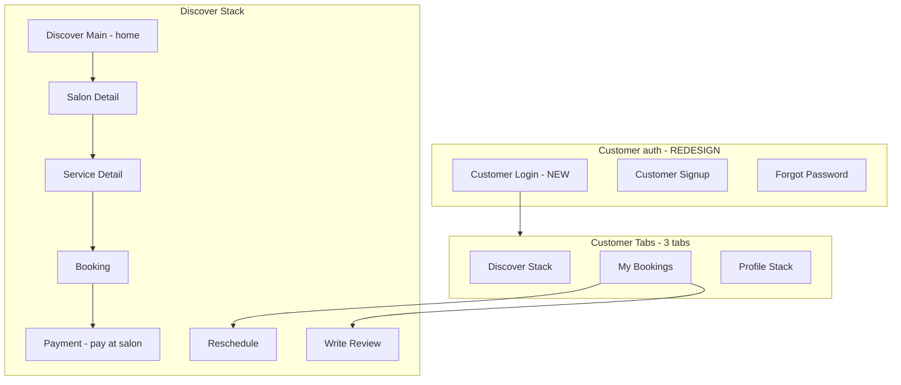

# TrimiT — Customer UI (Google Stitch)

**Audience:** Google Stitch / design tools  
**Scope:** Customer role only — login/signup and **Discover** home (not salon owner)  
**Status:** **Redesign in progress** — owner UI stays unchanged; customer auth + discovery get a **new modern UI**

---

## 1. Customer vs salon owner (important)

| | **Customer** (this doc) | **Salon owner** (separate doc) |
|---|-------------------------|--------------------------------|
| **Home after login** | **Discover** tab (search salons) | **Dashboard** tab (analytics) |
| **Tabs** | Discover · Bookings · Profile | Dashboard · Bookings · Services · Settings |
| **Login today** | Shared `LoginScreen` with owners | Same screen today |
| **Login target** | **Dedicated customer login** (new Stitch designs) | Keep existing owner login look |
| **Signup** | Role “Customer” on `RoleSelect` → Signup | Role “Salon Owner” → Signup |

After login, backend `user.role === 'customer'` → `CustomerTabs`.  
See **`STITCH_SALON_OWNER_UI_SPEC.md`** for owner screens.

---

## 2. Product context (customer)

- Book salon appointments near the user’s location  
- Browse list or map, open salon, pick service, choose date/slot/staff, confirm  
- v1 payment: **Pay at salon** (no Razorpay UI in production)  
- India market: ₹ prices, English UI (Hindi copy optional later)

---

## 3. Design direction (customer — modern redesign)

Design a **fresh, consumer-grade** booking app — warmer and more approachable than the owner dashboard.

| Principle | Guidance |
|-----------|----------|
| **Feel** | Friendly, fast, trustworthy — “find & book in 3 taps” |
| **Light mode** | Background `#FAFAF9`, primary CTA `#9A3412`, white cards |
| **Typography** | Cormorant Garamond headlines; Inter body |
| **Shapes** | 16px cards, **pill** primary buttons, large search bar |
| **Imagery** | Salon photos dominant on Discover & Salon detail |
| **Motion** | Skeleton lists, subtle slot selection, success on confirm |

**Stitch focus:** Auth (customer-only entry) + Discover flow first, then booking stack.

---

## 4. Design tokens (customer)

| Token | Light value | Use |
|-------|-------------|-----|
| `background` | `#FAFAF9` | Screen bg |
| `surface` | `#FFFFFF` | Cards, search |
| `primary` | `#9A3412` | CTAs, active tab |
| `primaryLight` | `#FFF7ED` | Selected chips |
| `text` | `#1C1917` | Titles |
| `textSecondary` | `#78716C` | Subtitles |
| `border` | `#E7E5E4` | Dividers |
| `success` | `#059669` | Confirmed booking |
| `star` | `#F59E0B` | Ratings |

**Spacing:** 20px screen horizontal padding · 16px card padding · tab bar 56px + safe area  

**Fonts:** H1 36 Cormorant · Body 16 Inter · Button 16 Inter SemiBold  

---

## 5. Customer navigation map

**Entry (today in code):** `AuthStack` → Login → (optional) RoleSelect → Signup with `role: customer`  
**Entry (target for Stitch):** Separate **Customer Login** screen → `CustomerTabs` (no owner UI on this path)

---

## 6. Customer screens (inventory)

### 6.1 Auth — **redesign these**

| Screen | File | Purpose | Design note |
|--------|------|---------|-------------|
| **Customer Login** | *new design* (today: shared `LoginScreen.tsx`) | Email + password sign-in | **New UI** — customer branding, “Book salons near you”, no owner/salon copy |
| **Customer Signup** | `SignupScreen.tsx` (`role: customer`) | Register as customer | Can match new login style; show “Customer” badge |
| **Forgot Password** | `ForgotPasswordScreen.tsx` | Reset email | Match customer login visual system |
| **Role select** | `RoleSelectScreen.tsx` | Pick Customer vs Owner | **Optional for customer-only flow** — deep link “I’m a salon owner” to owner doc/login |

#### Customer Login — target layout (Stitch)

| Zone | Components |
|------|------------|
| Hero | Logo, headline e.g. “Book your next visit”, subline |
| Form | Email `Input`, Password `Input` + show/hide |
| Primary CTA | Pill button “Sign in” |
| Links | Forgot password · Create account |
| Footer | Privacy · Terms (text links) |
| Secondary | Small text: “Salon owner? Sign in to dashboard” → owner login (separate design) |
| States | Inline validation, API error banner, loading on button |

#### Customer Signup — target layout

| Zone | Components |
|------|------------|
| Header | Back, “Create account” |
| Badge | “Customer” with people icon |
| Form | Name, Email, Phone, Password, Confirm password |
| Legal | Agree to Terms & Privacy checkbox |
| CTA | “Create account” |
| Footer | Already have account? Sign in |

---

### 6.2 Discover tab — **home screen (customer dashboard)**

> **Not** the owner Dashboard. Customer “home” = **Discover Main**.

| Screen | File | Tab |
|--------|------|-----|
| **Discover Main** | `DiscoverScreen.tsx` | Discover (stack root) |
| Salon Detail | `SalonDetailScreen.tsx` | pushed |
| Service Detail | `ServiceDetailScreen.tsx` | pushed |
| Booking | `BookingScreen.tsx` | pushed |
| Reschedule | `RescheduleBookingScreen.tsx` | pushed |
| Payment | `PaymentScreen.tsx` | pushed (v1: pay-at-salon message) |
| Write Review | `WriteReviewScreen.tsx` | pushed |

#### Discover Main — components by zone

| Zone | Components | Data / behavior |
|------|------------|-----------------|
| **Header** | Title “Discover” or location line (“Near you”) | Uses GPS / last location |
| **Search** | Rounded **search bar**, search icon, placeholder “Search salons…” | Filters salon list |
| **Mode toggle** | **List \| Map** segmented control | Switches layout |
| **List mode** | `FlatList` of **SalonCard** | Pull-to-refresh, pagination |
| **Map mode** | Map + **SalonMapMarker** / clusters | Permission primer first time |
| **Overlays** | **PermissionPrimer**, **OfflineBanner** | Location / network |
| **States** | **SalonListSkeleton**, **EmptyState**, **ErrorState** + retry | |

#### Salon Detail

| Zone | Components |
|------|------------|
| Hero | **ImageCarousel** |
| Info | Name, ★ rating, review count, address, hours |
| Map | Mini map + Directions |
| Services | List of **ServiceCard** |
| CTA | “Book” on service row → Service Detail |

#### Service Detail

| Zone | Components |
|------|------------|
| Hero | Service image |
| Body | Name, description, duration, price (₹) |
| CTA | Primary “Book appointment” → Booking |

#### Booking (core flow)

| Zone | Components |
|------|------------|
| Header | Back, salon + service name |
| Staff | **StaffPicker** — “Any available” + staff avatars |
| Date | Horizontal date chips (~14 days) |
| Time | **Slot grid** — pills, 30-min slots |
| Promo | Optional code input + Apply |
| Payment | **Pay at salon** selected (v1); online hidden |
| Summary | Subtotal, discount, total ₹ |
| Footer | Sticky “Confirm booking” **Button** |
| States | Loading slots, slot taken error, hold timer |

#### Reschedule / Payment / Write Review

| Screen | Key components |
|--------|----------------|
| Reschedule | Current booking card, date + slots, reason input, Confirm |
| Payment | Booking summary; v1 alert “Pay at salon” |
| Write Review | 1–5 stars, multiline text, Submit |

---

### 6.3 Bookings tab

| Screen | File | Components |
|--------|------|------------|
| **My Bookings** | `MyBookingsScreen.tsx` | Header “My Bookings”, **BookingCard** list, pull-to-refresh, **BookingListSkeleton**, **EmptyState** |

**BookingCard (customer view):** service name, salon name, date/time, status pill (pending / confirmed / completed / cancelled), tap → reschedule or review.

---

### 6.4 Profile tab

| Screen | File | Components |
|--------|------|------------|
| **Profile Main** | `ProfileScreen.tsx` | Avatar initial, name, Customer badge, edit name/phone, theme Light/Dark/System, **NotificationSettingsSection**, legal rows, Logout, Delete account |
| Privacy / Terms / Contact | `legal/*` | Back header, **MarkdownView** or contact links |

---

## 7. Customer-only components

Use these in Stitch component library for customer flows:

| Component | Used on |
|-----------|---------|
| **Button** | primary / outline / ghost, sm–lg, loading·success·error |
| **Input** | Login, signup, search, promo, profile |
| **ScreenWrapper** | `variant`: tab · stack · auth |
| **SalonCard** | Discover list — image, name, ★, distance km, from ₹ |
| **ServiceCard** | Salon detail |
| **BookingCard** | My bookings |
| **StaffPicker** | Booking |
| **ImageCarousel** | Salon detail |
| **SalonMapMarker** | Discover map |
| **PermissionPrimer** | Location before map |
| **EmptyState** | No salons / no bookings |
| **ErrorState** | API failure + retry |
| **SalonListSkeleton** / **BookingListSkeleton** | Loading |
| **OfflineBanner** | No network |
| **Toast** | Success / error messages |
| **TrimiTLogoMark** | Auth hero |

**Not used on customer home:** owner charts, **DashboardSkeleton**, **BookingNotificationModal** (owner), **WorkingHoursEditor**, stat cards.

---

## 8. Customer bottom tab bar

| Tab | Icon (Ionicons) | Screen |
|-----|-----------------|--------|
| **Discover** | `search` | Discover stack (default) |
| **Bookings** | `calendar` | My Bookings |
| **Profile** | `person` | Profile stack |

Active tint: `primary` · Inactive: `textTertiary` · Height: 56 + safe area

---

## 9. Screen states (design all variants)

| State | Customer screens |
|-------|------------------|
| Loading | Skeleton on Discover / Bookings |
| Empty | No salons nearby · No bookings yet |
| Error | Retry on Discover |
| Offline | Banner; disable search/map actions |
| Success | Toast after book / profile save |

---

## 10. Google Stitch prompts (customer)

**Customer login (new):**

> Mobile app screen, TrimiT **customer** login. Light background #FAFAF9, orange primary #9A3412, Inter + Cormorant fonts. Hero: logo and “Book salons near you”. Email and password fields, pill “Sign in” button, links Forgot password and Create account. Footer link “Salon owner? Go to business login”. iPhone portrait, modern minimal, no purple gradients.

**Discover (customer home):**

> TrimiT **customer Discover** screen (not owner dashboard). Search bar, List/Map toggle, scrollable salon cards with photo, 4.5★, 2.3 km, from ₹299. Bottom tabs: Discover active, Bookings, Profile. Empty state: no salons nearby.

**Booking:**

> TrimiT customer booking: staff chips, horizontal dates, 4-column time slots, Pay at salon selected, order summary ₹, orange Confirm booking button.

---

## 11. Out of scope (customer doc)

- Owner Dashboard, Manage Bookings/Services, Staff, Promos  
- Owner login visual (see salon owner doc)  
- Web portal  
- Razorpay WebView detail (v1 off)

---

## 12. Code reference

| Area | Path |
|------|------|
| Customer screens | `mobile/src/screens/customer/` |
| Customer auth (shared today) | `mobile/src/screens/auth/` |
| Customer navigation | `mobile/src/navigation/CustomerTabs.tsx`, `CustomerStack.tsx` |
| Components | `mobile/src/components/` |

---

*Pair with `STITCH_SALON_OWNER_UI_SPEC.md`. Update when customer-only auth routes are implemented in code.*
