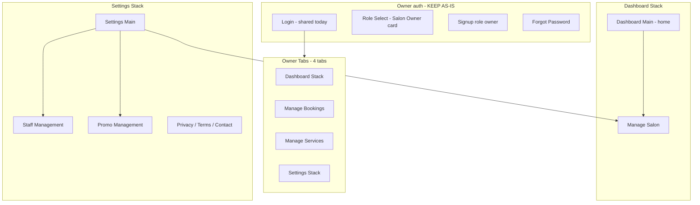

# TrimiT — Salon Owner UI (Google Stitch)

**Audience:** Google Stitch / design tools  
**Scope:** Salon owner role only — login/signup and **Dashboard** home (not customer Discover)  
**Status:** **Keep current UI as-is** — document for reference and consistency; **do not redesign** owner screens in Stitch unless fixing small polish

---

## 1. Salon owner vs customer (important)

| | **Salon owner** (this doc) | **Customer** (separate doc) |
|---|----------------------------|-----------------------------|
| **Home after login** | **Dashboard** tab (stats & charts) | **Discover** tab (find salons) |
| **Tabs** | Dashboard · Bookings · Services · Settings | Discover · Bookings · Profile |
| **Login** | Same API today; **owner login look stays current** | **New customer login** (redesign) |
| **Signup** | Role “Salon Owner” on RoleSelect | Role “Customer” |

After login, `user.role === 'owner'` → `OwnerTabs`.  
See **`STITCH_CUSTOMER_UI_SPEC.md`** for customer screens.

---

## 2. Product context (salon owner)

- Run one salon business on mobile  
- See today’s bookings, revenue, pending count  
- Accept/reject incoming bookings (realtime + modal)  
- Manage services, staff, promos, salon profile & hours  
- Push notifications for new bookings

---

## 3. Design direction (owner — preserve existing)

Match the **current app** — operational, data-dense, professional.

| Principle | Current implementation |
|-----------|-------------------------|
| **Feel** | Business dashboard — stats, charts, quick actions |
| **Light mode** | Stone bg `#FAFAF9`, primary `#9A3412` |
| **Dark mode** | Supported — obsidian + gold accents |
| **Typography** | Cormorant headings + Inter UI |
| **Components** | Stat cards, charts, booking cards with actions |
| **Stitch rule** | **Replicate existing screens**, don’t invent new owner visual language |

---

## 4. Design tokens (owner — same system)

| Token | Light value | Use |
|-------|-------------|-----|
| `background` | `#FAFAF9` | Screen bg |
| `surface` | `#FFFFFF` | Cards |
| `primary` | `#9A3412` | CTAs, active tab |
| `success` | `#059669` | Confirmed, live pulse |
| `error` | `#DC2626` | Tab badge, cancel |
| `warning` | `#D97706` | Pending bookings |

Tab bar: 4 tabs, badge on **Bookings** when `pending_bookings > 0`.

---

## 5. Salon owner navigation map

**Owner “home” = Dashboard Main** — not Discover.

---

## 6. Salon owner screens (inventory)

### 6.1 Auth — **keep as-is**

| Screen | File | Purpose |
|--------|------|---------|
| **Login** | `LoginScreen.tsx` | Shared with customers today — same layout |
| **Role select** | `RoleSelectScreen.tsx` | Tap **Salon Owner** card → Signup |
| **Signup** | `SignupScreen.tsx` | `role: owner`, badge “Salon Owner” |
| **Forgot password** | `ForgotPasswordScreen.tsx` | Email reset |

#### Salon owner login — current layout (do not redesign)

| Zone | Components |
|------|------------|
| Header | Logo image, welcome copy |
| Form | Email **Input**, Password **Input** + visibility toggle |
| Error | **ErrorState** inline for API errors |
| CTA | **Button** “Sign in” (loading state) |
| Links | Forgot password · Sign up · Privacy · Terms |

#### Salon owner signup — current layout

| Zone | Components |
|------|------------|
| Badge | “Salon Owner” + storefront icon |
| Form | Name, email, phone, password, confirm |
| Legal | Terms checkbox |
| CTA | Create account |

---

### 6.2 Dashboard tab — **owner home**

| Screen | File | Tab |
|--------|------|-----|
| **Dashboard Main** | `OwnerDashboardScreen.tsx` | Dashboard (stack root) |
| Manage Salon | `ManageSalonScreen.tsx` | From dashboard or settings |

#### Dashboard Main — components by zone

| Zone | Components | Notes |
|------|------------|-------|
| **Header** | Salon name, **PulseIndicator** (live) | Realtime bookings |
| **Period filter** | Chips: Today \| 7d \| 30d \| All | Drives analytics |
| **Stats row** | 4× **AnimatedStatCard** | Revenue, bookings, pending, completed |
| **Charts** (delayed load) | **BookingsTrendChart**, **PopularServicesChart**, **StatusDistributionChart** | Toggle section |
| **Recent bookings** | Up to 3× **BookingCard** | Quick view |
| **Empty salon** | **EmptyState** + CTA → Manage Salon | New owner |
| **States** | **DashboardSkeleton**, **ErrorState**, pull-to-refresh | |

---

### 6.3 Bookings tab

| Screen | File | Components |
|--------|------|------------|
| **Manage Bookings** | `ManageBookingsScreen.tsx` | Header, status filters, **BookingCard** list with **Accept / Complete / Cancel** actions, **BookingListSkeleton**, tab **badge** for pending count |

**Global overlay:** **BookingNotificationModal** — new booking popup, Accept / Reject.

---

### 6.4 Services tab

| Screen | File | Components |
|--------|------|------------|
| **Manage Services** | `ManageServicesScreen.tsx` | Header + add, service rows (name, ₹, duration, active toggle), add/edit form, **ServiceListSkeleton**, **EmptyState** |

---

### 6.5 Settings tab (stack)

| Screen | File | Components |
|--------|------|------------|
| **Settings Main** | `SettingsScreen.tsx` | Salon info card, links to Manage Salon / Staff / Promos / Services tab, **NotificationSettingsSection**, theme toggle, account delete, legal rows, logout |
| **Manage Salon** | `ManageSalonScreen.tsx` | Name, description, phone, address, **LocationPickerModal**, images, **WorkingHoursEditor**, Save |
| **Staff Management** | `StaffManagementScreen.tsx` | Staff list, **StaffFormModal**, **StaffProfileCard** |
| **Promo Management** | `PromoManagementScreen.tsx` | Promo list, create form |
| Privacy / Terms / Contact | `legal/*` | **MarkdownView** |

**Settings without salon:** Limited UI — “No Salon Yet”, theme, notifications, CTA create salon.

---

## 7. Salon owner components

| Component | Used on |
|-----------|---------|
| **Button** | CTAs across settings, empty states |
| **Input** | Salon form, staff form, promos |
| **ScreenWrapper** | tab / stack variants |
| **BookingCard** | Dashboard recent, Manage bookings (+ owner actions) |
| **DashboardSkeleton** | Dashboard loading |
| **BookingsTrendChart** | Dashboard |
| **PopularServicesChart** | Dashboard |
| **StatusDistributionChart** | Dashboard |
| **PulseIndicator** | Dashboard header (live) |
| **BookingNotificationModal** | New booking (global) |
| **WorkingHoursEditor** | Manage salon |
| **LocationPickerModal** | Salon address |
| **StaffFormModal** | Staff CRUD |
| **StaffProfileCard** | Staff detail |
| **NotificationSettingsSection** | Settings |
| **EmptyState** / **ErrorState** | No salon, API errors |
| **Toast** | Save confirmations |

**Not primary on owner flows:** **SalonCard**, **SalonMapMarker**, **StaffPicker** (customer booking), Discover search.

---

## 8. Owner bottom tab bar

| Tab | Icon | Screen | Extra |
|-----|------|--------|-------|
| **Dashboard** | `grid` | Dashboard stack | Owner home |
| **Bookings** | `calendar` | Manage Bookings | Red **badge** = pending count |
| **Services** | `pricetag` | Manage Services | |
| **Settings** | `settings` | Settings stack | |

---

## 9. Owner-specific data on UI

| Element | Fields |
|---------|--------|
| Stat card | `title`, `value`, icon, color |
| Analytics period | today / 7d / 30d / all |
| BookingCard (owner) | customer name, service, slot, status, action buttons |
| Service row | name, price ₹, duration, `is_active` |
| Staff row | name, photo, active |

---

## 10. Screen states (owner)

| State | Screens |
|-------|---------|
| Loading | DashboardSkeleton, booking/service skeletons |
| Empty | No salon, no bookings, no services |
| Error | Dashboard retry, inline errors |
| Realtime | Pulse + modal on new booking |
| Badge | Pending count on Bookings tab |

---

## 11. Google Stitch prompts (owner — match existing)

**Owner login (keep current style):**

> TrimiT **salon owner** login, same as existing app: logo, email/password fields, orange sign-in button #9A3412, stone background #FAFAF9. Professional, not consumer-playful. Link to sign up as salon owner.

**Dashboard (owner home — not Discover):**

> TrimiT **salon owner dashboard**: salon name, green live dot, period chips Today/7d/30d/All, 2×2 stat cards (revenue, bookings, pending, completed), line chart, recent bookings list. Bottom tabs: Dashboard active, Bookings with red badge, Services, Settings.

**Manage bookings:**

> TrimiT owner bookings list: filter chips by status, booking cards with customer name, Accept and Cancel buttons, pending highlighted.

---

## 12. Out of scope (owner doc)

- Customer Discover, map, SalonCard browse  
- Customer login redesign  
- Payment / Razorpay customer flow  

---

## 13. Code reference

| Area | Path |
|------|------|
| Owner screens | `mobile/src/screens/owner/` |
| Owner navigation | `mobile/src/navigation/OwnerTabs.tsx`, `OwnerStack.tsx` |
| Auth (shared) | `mobile/src/screens/auth/` |
| Charts | `mobile/src/components/charts/` |

---

*Pair with `STITCH_CUSTOMER_UI_SPEC.md`. Owner UI: preserve; only customer auth/discovery gets a new Stitch pass.*
