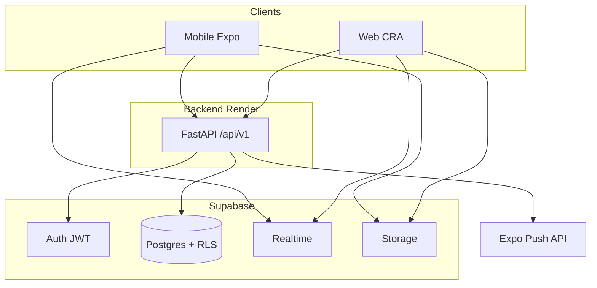
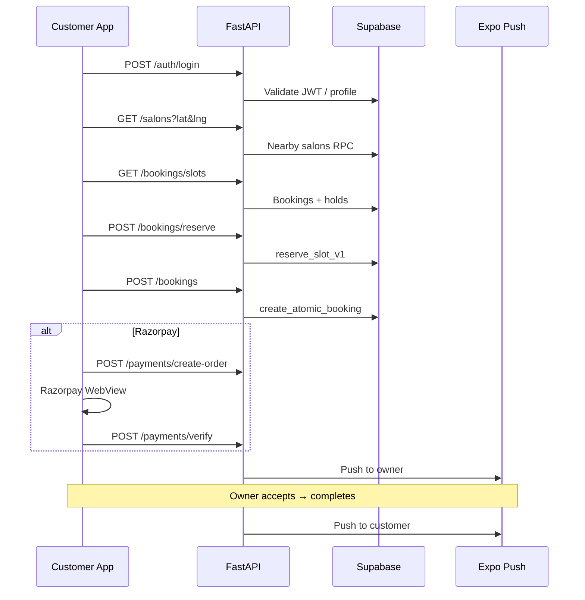

# Application Flow

High-level journeys across TrimiT's three clients sharing one FastAPI backend and Supabase database.

---

## System context

---

## User roles

| Role | Primary client | Capabilities |
|------|----------------|--------------|
| Customer | Mobile (primary), Web | Discover, book, pay, review |
| Owner | Mobile + Web | Manage salon, services, bookings, promos, staff |

---

## Customer journey (happy path)

---

## Owner journey (happy path)

1. Sign up as **owner** → create salon profile
2. Add services + optional staff
3. Receive push / realtime alert on new booking
4. Accept booking → mark completed
5. Customer receives completion push + can leave review

---

## Cross-client data flow

| Data | Source of truth | Client cache |
|------|-----------------|--------------|
| User profile | `users` table | Zustand persist |
| Salons/services | Postgres | React Query |
| Bookings | Postgres | React Query + Realtime |
| Slots | Computed server-side | React Query (short TTL) |
| Push prefs | `users` columns | Refetch on settings save |

---

## Module map

| Module | Mobile screens | Web pages | API prefix |
|--------|----------------|-----------|------------|
| Auth | `screens/auth/*` | `pages/Login*` | `/auth` |
| Discover | `DiscoverScreen` | `CustomerHome` | `/salons` |
| Booking | `BookingScreen` | `BookingPage` | `/bookings` |
| Payments | `PaymentScreen` | — | `/payments` |
| Owner | `owner/*` | `owner/*` | `/owner`, `/salons` |
| Reviews | `WriteReviewScreen` | — | `/reviews` |
| Promos | `PromoManagementScreen` | — | `/promotions` |

---

## Related docs

- [auth-flow.md](./auth-flow.md)
- [booking-flow.md](./booking-flow.md)
- [backend-flow.md](./backend-flow.md)
