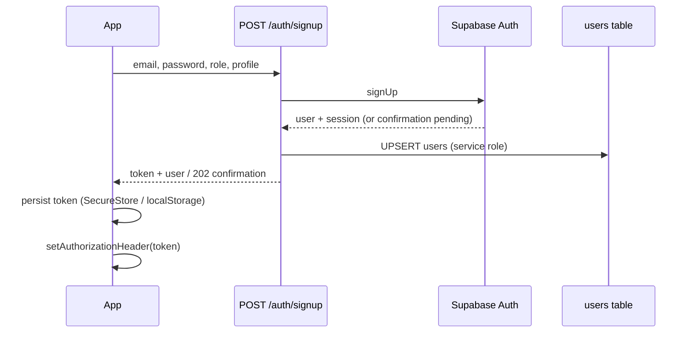
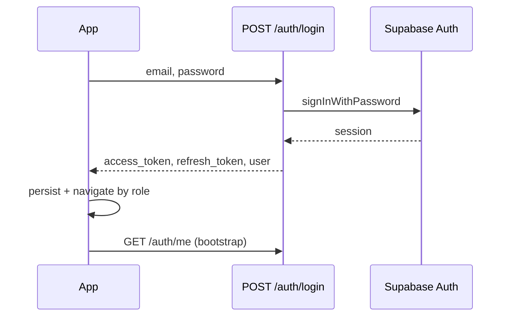

# Authentication Flow

Aligned reference for **mobile** and **web** — goal: identical behavior for sign-in, session, roles, and logout.

---

## Stack

| Component | Technology |
|-----------|------------|
| Identity provider | Supabase Auth |
| API auth | `Authorization: Bearer <access_token>` |
| Profile | `public.users` (role: `customer` \| `owner`) |
| Backend validation | `dependencies/auth.get_current_user` |

---

## Sign-up flow



| Step | Mobile | Web | Aligned? |
|------|--------|-----|----------|
| Role selection | `RoleSelect` → `SignupScreen` | SignupPage role picker | ✅ |
| Terms acceptance | Checkbox | Checkbox (silent fail bug on web) | ⚠️ |
| Email confirmation | Dedicated screen | Dedicated screen | ✅ |
| Profile row created | Backend service role | Same | ✅ |

---

## Sign-in flow



| Step | Mobile | Web | Aligned? |
|------|--------|-----|----------|
| Token storage | SecureStore | localStorage | ⚠️ Security differs |
| Refresh token stored | Yes | No | ❌ |
| Header injection | apiClient interceptor | axios interceptor | ✅ |
| Role routing | CustomerTabs / OwnerTabs | `/discover` vs `/owner/*` | ✅ |
| Owner hasSalon check | Weak (per-screen empty) | `hasSalon` in store | ⚠️ |

---

## Session persistence

### Cold start

1. Rehydrate Zustand from storage
2. `initializeAuth()` → `GET /auth/me`
3. Valid → set user, role, optional `hasSalon`
4. Invalid → `clearSession()` (+ `sessionExpired` flag on mobile)

### Mobile extras
- `syncSupabaseAuthSession(token, refreshToken)` for Realtime RLS
- Duplicate init from `App.tsx` + `onRehydrateStorage` (redundant call)

### Web gaps
- No Supabase `setAuth` on restore → realtime subscriptions may not filter correctly
- 401 interceptor clears storage + `window.location = '/login'` (hard redirect)

---

## Logout

| Action | Mobile | Web |
|--------|--------|-----|
| Clear token | ✅ | ✅ |
| Clear Zustand | ✅ | ✅ |
| Clear React Query | ✅ | ❌ |
| Supabase signOut | ✅ | N/A |
| Navigate to login | ✅ Auth stack | ✅ redirect |

---

## Password reset

| Step | Mobile | Web |
|------|--------|-----|
| Request reset email | `ForgotPasswordScreen` → API | `ForgotPasswordPage` → API |
| Handle recovery link | Opens **browser** | `ResetPasswordPage` + hash token |
| Validate token | — | `validate-reset-token` |
| Set new password | — | `resetPassword` in store |

**Alignment gap:** Mobile needs deep link handler (`trimit://reset`) or universal link to match web.

---

## Protected routes

### Mobile (`navigation/index.tsx`)
```
!isAuthenticated → AuthStack
user.role === 'owner' → OwnerTabs
else → CustomerTabs
```

### Web (`App.js`)
```
ProtectedRoute:
  !isAuthenticated → /login
  wrong role → /
```

---

## API signing (mutations)

| Client | Signs requests? |
|--------|---------------|
| Mobile | Yes (`lib/security.ts`) when secret set |
| Web | **No** |

**Action:** Implement web signing OR disable `SignatureMiddleware` until both clients ready.

---

## Auth alignment checklist

- [ ] Web stores refresh token (optional but recommended)
- [ ] Web syncs Supabase session for realtime
- [ ] Mobile in-app password reset screen
- [ ] Fix web signup terms silent failure
- [ ] Fix web `LoginPage` rememberMe arity
- [ ] Unified owner `hasSalon` redirect
- [ ] Web API signing
- [ ] Single canonical `PUBLIC_SITE_URL` for reset emails

---

## Environment variables

| Var | Mobile | Web | Backend |
|-----|--------|-----|---------|
| Supabase URL | `EXPO_PUBLIC_*` | `REACT_APP_*` | `SUPABASE_URL` |
| Anon key | `EXPO_PUBLIC_*` | `REACT_APP_*` | `SUPABASE_ANON_KEY` |
| API URL | `EXPO_PUBLIC_API_URL` | `REACT_APP_API_URL` | — |
| JWT secret | — | — | `JWT_SECRET` |
| Signing secret | `EXPO_PUBLIC_API_SIGNING_SECRET` | **missing** | `API_SIGNING_SECRET` |
