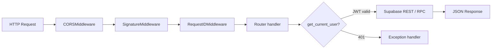

# Backend Flow

FastAPI request lifecycle and service boundaries.

---

## Request pipeline



**Order note:** CORS is outermost (added last in `server.py`).

---

## Supabase client pattern

`core/supabase.py` — httpx wrapper:

```python
await supabase.request(method, path, json=..., token=user_jwt, service_role=False)
```

| Mode | When |
|------|------|
| User JWT | RLS-enforced reads/writes |
| Service role | Admin: profile create, slots, push prefs, idempotency, uploads |
| Anon | Public salon reads |

---

## Router responsibilities

| Router | Prefix | Key operations |
|--------|--------|----------------|
| `auth` | `/auth` | signup, login, me, profile, push-token, notification-prefs, delete account |
| `salons` | `/salons` | CRUD, nearby search, services nested |
| `bookings` | `/bookings` | slots, reserve, create, status, reschedule, list |
| `payments` | `/payments` | create-order, verify |
| `promotions` | `/promotions` | CRUD, validate |
| `staff` | `/staff` | **broken** — staff CRUD |
| `owner` | `/owner` | dashboard stats |
| `reviews` | `/reviews` | create (requires completed booking) |
| `uploads` | `/uploads` | service images to storage |

---

## Service layer

| Service | Called from | Responsibility |
|---------|-------------|----------------|
| `booking_push` | `bookings` router | Map HTTP events to push |
| `push_dispatch` | `booking_push` | Templates, dedupe gate |
| `push_preferences` | `push_dispatch` | Read prefs, write `notification_events` |
| `push_notifications` | `push_dispatch` | HTTP to Expo |
| `auth_errors` | `auth` router | Map Supabase errors to API codes |

**Convention:** New reusable logic → `backend/services/`, keep routers thin.

---

## Idempotency

`@idempotency_required` on `POST /bookings/` and payment verify.

- Header: `Idempotency-Key`
- Stored in `idempotency_keys` (service role)
- **Gap:** optional header; cache key omits path

---

## Error response shape

```json
{
  "error": {
    "code": "BOOKING_CONFLICT",
    "message": "Slot no longer available",
    "request_id": "uuid"
  }
}
```

---

## Health & deploy

- `GET /health` — Supabase ping (service role)
- Render: gunicorn + uvicorn workers
- Env: see `backend/config.py`

---

## Extension points (future)

| Feature | Suggested location |
|---------|-------------------|
| Razorpay webhooks | `routers/payments.py` + `services/razorpay_webhook.py` |
| Booking sweeper | Supabase cron → `services/booking_cleanup.py` |
| Email notifications | `services/email_notifications.py` |
| Rate limit user binding | Middleware sets `request.state.user` after auth |
