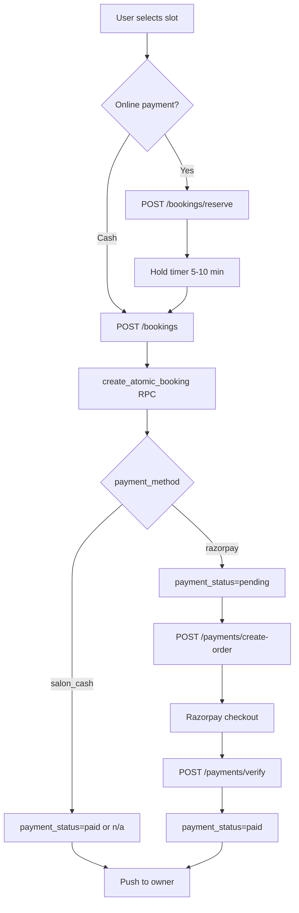

# Booking Flow

End-to-end booking lifecycle from slot discovery to completion and notifications.

---

## States

| Status | Set by | Customer can | Owner can |
|--------|--------|--------------|-----------|
| `pending` | Create (default) | Cancel | Accept / Reject |
| `confirmed` | Owner accept | Cancel (policy) | Complete |
| `completed` | Owner | Review | — |
| `cancelled` | Either | — | — |
| `rejected` | Owner | — | — |

Payment fields: `payment_method` (`razorpay` \| `salon_cash`), `payment_status` (`pending` \| `paid`)

---

## Slot availability algorithm

**Endpoint:** `GET /api/v1/bookings/slots`

1. Load salon opening hours for requested date
2. Generate 30-minute windows
3. Subtract bookings where `status != 'cancelled'`
4. Subtract active `slot_holds` (other users)
5. Apply 5-minute past-time grace (salon timezone)
6. Respect `max_bookings_per_slot` per salon

**Client:** Mobile subscribes to Realtime on `bookings` to invalidate slot query when others book.

---

## Booking creation (detailed)

---

## Race condition controls

| Layer | Mechanism | Gap |
|-------|-----------|-----|
| UI | Hold timer + realtime | Web lacks realtime |
| API reserve | `reserve_slot_v1` RPC | Fallback uses service role |
| API create | `create_atomic_booking` | Doesn't count holds |
| DB | Per-user UNIQUE on booking tuple | No slot-level UNIQUE |
| Payment | — | Pending rows block slots forever |

---

## Reschedule flow

**Endpoint:** `PATCH /api/v1/bookings/{id}/reschedule`

- Uses `reschedule_booking_atomic` RPC
- Logs row in `booking_reschedules`
- Push notification to other party
- Mobile: `RescheduleBookingScreen` mirrors slot selection

---

## Cancellation

**Endpoint:** `PATCH /api/v1/bookings/{id}/status` → `cancelled`

- Verify RLS allows customer UPDATE (may need migration)
- Push to owner/customer per `push_dispatch` rules

---

## Notifications on booking events

| Event | Recipient | Pref gate |
|-------|-----------|-----------|
| New booking | Owner | `notify_bookings` |
| Accepted | Customer | `notify_booking_updates` |
| Completed | Customer | `notify_booking_updates` |
| Cancelled | Both | `notify_booking_updates` |
| Rescheduled | Both | `notify_booking_updates` |

Dedupe: `notification_events` table.

---

## Known issues (pre-launch)

1. Mock Razorpay orders — payments unreliable
2. Pending payment blocks slots — needs sweeper
3. RPC callable by anon with arbitrary `p_user_id`
4. Web: cash-only, no hold, no realtime slots
5. Staff router broken — staff selection may fail server-side

---

## Testing scenarios

| # | Scenario | Expected |
|---|----------|----------|
| 1 | Two users same slot | Second fails or gets conflict |
| 2 | Hold expires | Slot returns to pool |
| 3 | Cash booking | Owner push, no payment step |
| 4 | Complete booking | Customer push |
| 5 | Cancel pending | Slot freed |
| 6 | Prefs OFF | No push, booking still works |
