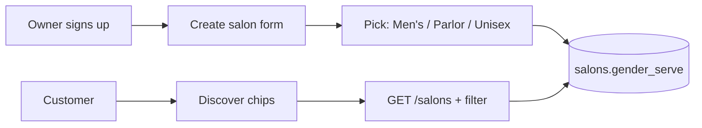
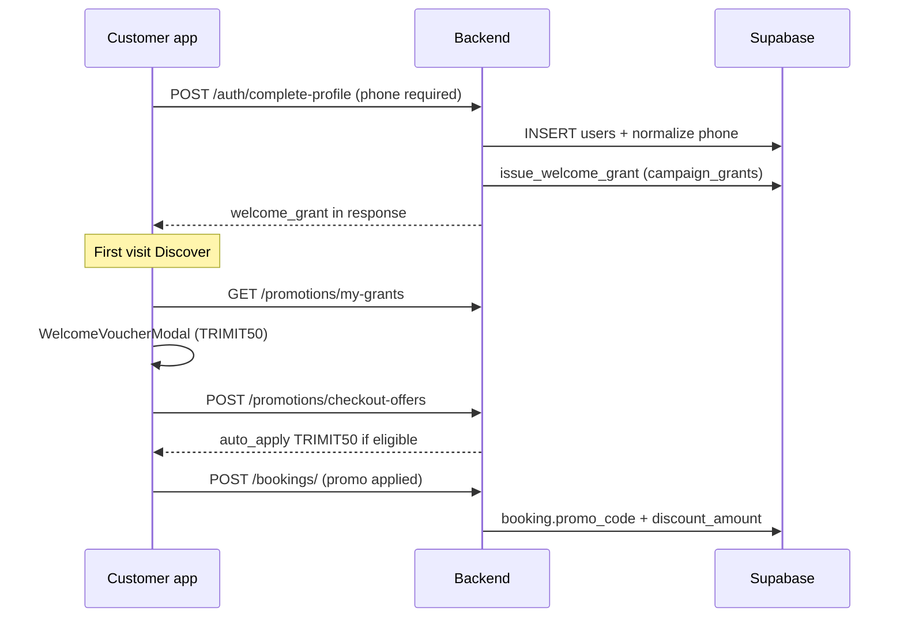

# TrimiT V2 — Developer Guide (beginner-friendly)

> **Audience:** Any developer joining the project who has never seen this codebase.
> **Last updated:** 2026-07-06 (after promo system + gender serve shipped on `main`).

This guide explains **three big features** shipped in v2:

1. **Salon vs Parlor** — one owner flow, one database table, different labels (`gender_serve`)
2. **Promo Lane A** — salon owners create their own discount codes
3. **Promo Lane B** — TrimiT platform welcome offer **TRIMIT50** (admin-controlled)

It also covers the **founder admin dashboard** (web-only).

---

## 1. How TrimiT is built (30-second map)

```
TrimiT/
├── backend/          FastAPI API (deployed on Render)
├── mobile/           Expo React Native app (Play Store)
├── frontend/         React web app (Vercel — trimit.online)
├── database/         SQL migrations (apply manually in Supabase)
├── shared/           app-version.json (version bump script reads this)
└── docs/v2_docs/     You are here — v2 documentation
```

**Rule of thumb:** Mobile and web talk to `https://<render-host>/api/v1/...`. The database is Supabase Postgres. Migrations are **never** auto-applied — you run `.sql` files in the Supabase SQL Editor.

---

## 2. Salon vs Parlor — NOT a separate signup

### What we did **not** build

- No separate “parlor owner” role
- No separate “Create parlor” screen
- No rule like “female owner = parlor, male owner = salon”

### What we **did** build

Every business is still a row in `public.salons`. We added one column:

| DB column | Values | What customers see |
|-----------|--------|-------------------|
| `gender_serve` | `men` | **Men's salon** |
| | `women` | **Parlor** |
| | `unisex` | **Unisex** |

**Owner picks this at salon setup** (same “Create salon” flow). A woman can run a men's salon; a man can run a parlor. The field describes the **business**, not the owner's gender.

### Customer side (discovery)

| DB column (users) | Purpose |
|-------------------|---------|
| `gender` | `male` / `female` — optional at signup, used for “For you” discover |
| `discovery_audience` | `auto` / `men` / `women` / `all` — profile preference |

Discover screen chips (mobile + web):

- **For you** — uses profile gender when set
- **Men's** — only `gender_serve = men` or `unisex`
- **Parlor** — only `gender_serve = women` or `unisex`
- **All** — no filter

### Unisex salons only

When `gender_serve = unisex`, each **service** can have `audience`: `men` | `women` | `both`. Dedicated men's/women's venues default services to that audience.

### Key files

| Layer | File |
|-------|------|
| Migration | `database/58_gender_serve_and_discovery.sql` |
| Labels & helpers | `mobile/src/lib/genderServe.ts`, `frontend/src/lib/genderServe.js` |
| Owner picker | `mobile/src/screens/owner/ManageSalonScreen.tsx`, `frontend/src/pages/owner/ManageSalon.js` |
| Discover filters | `mobile/src/screens/customer/DiscoverScreen.tsx`, `frontend/src/pages/customer/CustomerHome.js` |
| Backend filter | `backend/services/gender_serve.py`, `GET /salons/?gender_serve=men|women` |
| RPC | `get_nearby_salons_v1` (7th param `p_gender_serve`) |

### Mental model



---

## 3. Promo system — two lanes (never mix money)

TrimiT has **two separate promo systems**. They must stay separate forever:

| | **Lane A — Salon** | **Lane B — Platform** |
|---|-------------------|----------------------|
| **Who pays** | Salon owner | TrimiT (you) |
| **Who creates** | Owner in mobile app | Admin + auto-issue on signup |
| **Scope** | One salon only | Many salons (with exclusions) |
| **Table** | `promo_codes` | `platform_campaigns` + `campaign_grants` |
| **Example** | `GLOW20` owner code | `TRIMIT50` welcome offer |

**Checkout rule:** Customer gets the **single best discount** — service offer vs Lane A code vs Lane B grant. They do **not** stack.

---

### Lane A — Owner salon promos

**Product flow**

1. Owner opens **Settings → Promo codes** (mobile; flag `ENABLE_OWNER_PROMO_MANAGEMENT`, on by default).
2. Creates code: flat or percent, min order, usage limit, expiry.
3. Customer books at that salon → **Offers from [Salon]** section → tap to apply.

**Backend**

| Endpoint | Purpose |
|----------|---------|
| `GET /promotions/owner` | List owner's codes |
| `POST /promotions/` | Create (auto-injects `salon_id`) |
| `PATCH /promotions/{id}` | Update |
| `DELETE /promotions/{id}` | Delete |
| `POST /promotions/validate` | Check code + amount |
| `POST /promotions/checkout-offers` | Zomato-style list + best price |

**Key files**

- `backend/routers/promotions.py`
- `backend/services/promo_pricing.py` — `resolve_checkout_pricing()`
- `database/59_salon_promo_hardening.sql` — salon-only validation RPC
- `mobile/src/screens/owner/PromoManagementScreen.tsx`
- `mobile/src/components/booking/CheckoutOffersSection.tsx`

**Important:** Migration 59 deactivates old **global** seed promos so only salon-scoped codes work for Lane A.

---

### Lane B — Platform TRIMIT50 (welcome campaign)

**Product rules (locked)**

| Rule | Value |
|------|-------|
| Code | `TRIMIT50` |
| Discount | Flat ₹50 off |
| Min order | ₹149 |
| Validity | 10 days from issue |
| Eligibility | First booking, new customer, unique phone |
| Funding | TrimiT reimburses salon offline (not automated yet) |

**Lifecycle**



**Tables (migration 61)**

- `platform_campaigns` — campaign config (`TRIMIT50` seed row)
- `campaign_grants` — one row per user/phone when issued
- `campaign_salon_exclusions` — opt-out specific salons

**Key files**

- `backend/services/campaigns.py`
- `backend/services/phone.py` — India `+91` normalization
- `backend/routers/auth.py` — `issue_welcome_grant` on customer complete-profile
- `database/60_customer_phone_unique.sql` — unique customer phone index
- `database/61_platform_campaigns.sql`
- `mobile/src/components/WelcomeVoucherModal.tsx`
- `mobile/src/screens/customer/MyOffersScreen.tsx`

**Phone is required** for customers at signup (anti-abuse for welcome grant). Owners need phone + UPI at signup.

---

## 4. Admin dashboard — web only

### How to open it

| | |
|---|---|
| **URL** | `https://trimit.online/admin` (local: `http://localhost:3000/admin`) |
| **Auth** | 6-digit **PIN** screen → exchanges for admin bearer token |
| **Not in mobile app** | Founder tool only |

### Required production env vars

Set on **Render** (backend) and ensure Vercel can reach the API:

| Variable | Where | Purpose |
|----------|-------|---------|
| `ADMIN_API_TOKEN` | Render | Secret bearer token for all `/admin/*` routes |
| `ADMIN_DASHBOARD_PIN` | Render | PIN you type on the login screen |

If either is **unset**, `/admin/login` returns **404** and the dashboard looks broken / empty.

### Tabs (what you can do today)

| Tab | Features |
|-----|----------|
| **Dashboard** | Overview stats, revenue/booking charts, owner list, grant 30-day subscription |
| **Leads** | Waitlist export, mark notified |
| **Campaigns** | **Lane B only** — toggle TRIMIT50 on/off, per-salon participation |

**Campaigns tab (Lane B)**

- Lists `platform_campaigns` rows
- Toggle **Active** for TRIMIT50
- Per salon: **Participating** on/off (exclusion list)
- If empty: migration **61** not applied or API token wrong

**Key files**

- `frontend/src/pages/admin/AdminDashboard.js`
- `frontend/src/services/adminService.js`
- `backend/routers/admin.py` — `/admin/campaigns`, `/admin/login`

There is **no** admin UI for Lane A owner promos — owners manage those in the mobile app.

---

## 5. File map — “where do I change X?”

| I want to change… | Start here |
|-------------------|------------|
| Parlor vs salon labels | `mobile/src/lib/genderServe.ts` → `SALON_TYPE_LABELS` |
| Discover filter logic | `genderServe.ts` → `salonMatchesDiscoverFilter` |
| Owner promo create form | `PromoManagementScreen.tsx` |
| Checkout offers UI | `CheckoutOffersSection.tsx`, `BookingScreen.tsx` |
| TRIMIT50 rules | `database/61_*.sql` seed + `backend/services/campaigns.py` |
| Welcome modal | `WelcomeVoucherModal.tsx`, `DiscoverScreen.tsx` |
| Admin campaign toggle | `AdminDashboard.js` → `view === 'campaigns'` |
| Best discount math | `backend/services/promo_pricing.py` |
| Salon create API | `backend/routers/salons.py` → `create_salon` |

---

## 6. Migrations you must have in production

Apply in order in Supabase SQL Editor (see `MIGRATION_ORDER_v2.md`):

| # | File | Required for |
|---|------|--------------|
| 44 | `44_fix_salon_subscription_trigger_fk.sql` | **New owners can create salon** |
| 57 | `57_service_categories.sql` | Service categories |
| 58 | `58_gender_serve_and_discovery.sql` | Salon / Parlor / discovery |
| 59 | `59_salon_promo_hardening.sql` | Lane A salon-only promos |
| 60 | `60_customer_phone_unique.sql` | Lane B phone anti-abuse |
| 61 | `61_platform_campaigns.sql` | Lane B TRIMIT50 + admin campaigns tab |

**Verify TRIMIT50 exists:**

```sql
SELECT code, active, discount_value, min_order_value, validity_days
FROM platform_campaigns WHERE code = 'TRIMIT50';
```

---

## 7. Co-founder checklist — what's done vs gaps

### Shipped and working (mobile-first)

- [x] Salon vs Parlor via `gender_serve` (owner picker, discover filters)
- [x] Lane A owner promos (mobile create + checkout offers)
- [x] Lane B TRIMIT50 (signup grant, welcome modal, My Offers, auto-apply at checkout)
- [x] Admin Campaigns tab (web `/admin` → Campaigns)
- [x] Salon create hardening (service-role insert)
- [x] Customer phone required at signup

### Gaps you should know about

| Gap | Impact | Recommendation |
|-----|--------|----------------|
| **Web checkout has no promo UI** | `BookingPage.js` has no `checkout-offers` — web customers can't use TRIMIT50 or salon codes yet | P1: port `CheckoutOffersSection` pattern to web |
| **Lane B settlement is manual** | TrimiT owes salons ₹50 per redeemed TRIMIT50; no payout automation | Track in spreadsheet until PayU/ledger ships |
| **Admin only on web** | No mobile admin | OK for v1 founder ops |
| **Admin invisible if env unset** | `ADMIN_API_TOKEN` / `ADMIN_DASHBOARD_PIN` missing → 404 | Set on Render; redeploy |
| **Phone OTP not live** | Email OTP only; DLT pending for SMS | Architecture supports phone later |
| **Parlor ≠ owner gender** | By design — don't revert to gender-based inference | Keep `gender_serve` on business |

### Corrections to common assumptions

| Assumption | Reality |
|------------|---------|
| “Female owner = parlor automatically” | **Wrong.** Owner chooses Men's / Parlor / Unisex at salon setup. |
| “Two separate onboarding flows” | **Wrong.** One owner flow, one `salons` table. |
| “TRIMIT50 is a salon promo” | **Wrong.** It's Lane B (platform). Owners create Lane A codes separately. |
| “Admin creates owner promo codes” | **Wrong.** Admin controls Lane B only. Owners create Lane A in the app. |
| “Promo migrations optional” | **Wrong for Lane B.** Without 61, admin Campaigns tab is empty and grants fail. |

---

## 8. Local dev quick start

```bash
# Backend
cd backend && source venv/bin/activate
PYTHONPATH=. uvicorn server:app --reload --port 8001

# Mobile (point at local or prod API via app config)
cd mobile && npm start

# Web
cd frontend && npm run dev
# Admin: http://localhost:3000/admin (needs ADMIN_* env on backend)
```

**Tests**

```bash
cd backend && PYTHONPATH=. pytest tests/test_promotions.py tests/test_gender_serve.py -q
cd mobile && npm test -- --testPathPattern=genderServe
```

---

## 9. Related docs

| Doc | Contents |
|-----|----------|
| `PROMO_SYSTEM.md` | Short promo reference + SQL snippets |
| `MIGRATION_ORDER_v2.md` | Full migration checklist |
| `PROGRESS_v2.md` | Session log / what shipped when |
| `CONTEXT_v2.md` | Product context for v2 |
| `RULES_v2.md` | Engineering rules for v2 work |

---

## 10. One-page summary for your co-founder

**Salon / Parlor:** Same product, one field `gender_serve`, labels in UI only.

**Lane A:** Owner-funded, salon-scoped codes — mobile owner screen + mobile checkout.

**Lane B:** TrimiT-funded TRIMIT50 — auto on signup, admin toggles participation, mobile checkout auto-applies.

**Admin:** `trimit.online/admin` + PIN → Dashboard / Leads / **Campaigns (Lane B)**.

**Next priority:** Web booking promo parity + confirm Render env vars for admin.
